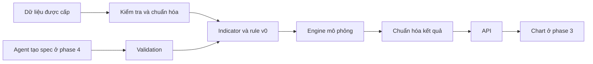

# Thiết kế kỹ thuật dự kiến

Ngày 09/09/2026 — bổ sung cho [plan v0](BACKTEST_PLAN_v0.md), giữ phạm vi 4 phase trong WBS. Mentor đã xác nhận có thể dùng CAN SLIM làm nguồn rule, không bắt buộc bản lite. Công nghệ và các điều kiện/tham số cụ thể vẫn là đề xuất nếu chưa ghi xác nhận. Chưa code sản phẩm.

## 1. Hướng triển khai để thử trước

**Căn cứ hiện tại:** người thực hiện đã có note backtesting.py; chưa inspect stock-app và chưa chạy đối chiếu engine. [Kết quả research](BACKTEST_PLAN_v0.md#open-source-research) là cơ sở cho thử nghiệm dưới đây, chưa chứng minh stack đã phù hợp đầy đủ.

Đề xuất thử Python + engine có sẵn + FastAPI cho MVP. Ưu tiên đánh giá backtesting.py bằng một ví dụ nhỏ; Backtrader là phương án thay thế nếu cách thu thập lịch sử tài khoản/giao dịch phù hợp hơn. Chỉ chọn một engine sau khi đối chiếu ví dụ và kiểm tra license của phiên bản sẽ dùng. Chưa chọn chỉ vì demo có lợi nhuận.

Luồng dự kiến:

API điều phối các bước trên khi có request. Sơ đồ thể hiện luồng dữ liệu; không yêu cầu tách thành nhiều service. Phase 1 có thể dùng một tiến trình, một strategy v0 và một bộ dữ liệu; chưa cần database hoặc hàng đợi.

## 2. Các phần cần viết và tài liệu để hiểu chúng

| Phần / WBS                 | Trách nhiệm                                                                                 | Nguồn kỹ thuật và mục cần đọc                                                                                                                                                                                                              |
| --------------------------- | --------------------------------------------------------------------------------------------- | -------------------------------------------------------------------------------------------------------------------------------------------------------------------------------------------------------------------------------------------------- |
| Data adapter — P1.2        | Nhận dữ liệu được cấp, thống nhất ngày, đơn vị và OHLCV; báo thiếu/trùng/sai | Data dictionary của bên cấp;[Backtest API](https://kernc.github.io/backtesting.py/doc/backtesting/backtesting.html), phần dữ liệu đầu vào                                                                                                  |
| Strategy — P1.3/P1.5       | Tính indicator, xử lý warm-up, tạo điều kiện mua/bán theo rule đã chốt             | [Quick Start](<https://kernc.github.io/backtesting.py/doc/examples/Quick%20Start%20User%20Guide.html>), phần Strategy; [ghi chú source](BACKTEST_PLAN_v0.md#open-source-research)                                                                                     |
| Engine adapter — P1.4/P1.6 | Truyền vốn/sizing/phí, ghi signal và fill, lấy kết quả engine                          | [Backtesting API](https://kernc.github.io/backtesting.py/doc/backtesting/backtesting.html), Backtest/Order/Trade; phương án thay thế: [Backtrader execution](https://www.backtrader.com/docu/order-creation-execution/order-creation-execution/) |
| Result mapper — P1.6       | Đưa kết quả engine về field của project, đối chiếu cash/equity và phí              | Các phát hiện accounting trong[inspect](BACKTEST_PLAN_v0.md#open-source-research); ví dụ số trong plan v0                                                                                                                                                        |
| API — P1.7                 | Validate request, gọi backtest, trả kết quả hoặc lỗi có ý nghĩa                      | [FastAPI Request Body](https://fastapi.tiangolo.com/tutorial/body/); [Pydantic Fields](https://pydantic.dev/docs/validation/latest/concepts/fields/)                                                                                                 |
| Spec và registry — P2     | Mô tả rule; liệt kê indicator/operator thực sự được hỗ trợ                         | Pydantic Fields; giới hạn tham số, enum và kiểm tra khả năng thực thi                                                                                                                                                                      |
| Chart — P3                 | Nhận kết quả API, vẽ nến/indicator/giao dịch                                            | [Markers](https://tradingview.github.io/lightweight-charts/tutorials/how_to/series-markers), [Panes](https://tradingview.github.io/lightweight-charts/tutorials/how_to/panes)                                                                        |
| Agent — P4                 | Chuyển mô tả thành spec; hỏi rõ chỗ thiếu; gọi lại engine có sẵn                  | Đọc docs model sau khi chốt model; trước mắt dùng danh mục hỗ trợ từ P2                                                                                                                                                                 |

## 3. Hợp đồng dữ liệu tối thiểu — bản nháp

**Input chuẩn hóa:** ngày/giờ, symbol, open, high, low, close, volume. Metadata gồm timeframe, đơn vị giá, timezone nếu có timestamp, raw/adjusted và mã phiên bản dataset. Bên cung cấp sẽ xác nhận; không mặc định đơn vị hoặc tự điền OHLC thiếu.

**Request đề xuất:** symbol, start_date, end_date, strategy_id, strategy_params, initial_cash, quantity, fee_rate, execution_model. `quantity` là số cổ phiếu; `fee_rate` là tỷ lệ thập phân, ví dụ giả lập 0.001 = 0.1%. Chưa có default chính thức; v0 dùng sizing cố định nếu được chốt. Chỉ nhận execution_model mà engine adapter đã triển khai.

**Response đề xuất:**

| Nhóm          | Field cần có                                                          | Ý nghĩa                                                                                         |
| -------------- | ----------------------------------------------------------------------- | ------------------------------------------------------------------------------------------------- |
| metadata       | run_id, dataset_version, engine_version, config                         | Biết lần chạy dùng dữ liệu và giả định nào                                             |
| signals        | signal_time, side, reason                                               | Điều kiện đã xuất hiện                                                                     |
| orders/fills   | signal_time, fill_time, side, quantity, fill_price, fee, status, reason | Phân biệt lệnh đã khớp với bị từ chối/chưa khớp; field fill để null khi chưa khớp |
| trades         | entry/exit time và price, quantity, fees, net_pnl                      | Giao dịch đã đóng; vị thế mở báo riêng                                                  |
| equity_history | time, cash, quantity, market_value, equity, unrealized_pnl              | Một dòng tại Close mỗi phiên thuộc khoảng báo cáo                                        |
| summary        | final_equity, net_pnl_closed, unrealized_pnl, total_return              | Return dựa trên equity/vốn đầu trong mô hình không nạp/rút                              |

Indicator chưa đủ warm-up trả null nếu xuất ra JSON. Lỗi đầu vào đề xuất trả HTTP 422 với field/code/message; lỗi nội bộ trả lỗi riêng. Không giao dịch vẫn là kết quả hợp lệ với trades rỗng và lịch sử tài khoản.

## 4. Quy tắc phải chốt trước khi thực thi

| Mục                                | Đề xuất / trạng thái                                                                                                          |
| ----------------------------------- | ---------------------------------------------------------------------------------------------------------------------------------- |
| CAN SLIM v0 | Đã được phép dùng nguồn CAN SLIM; tiếp theo lập bảng điều kiện, field, ngưỡng, entry/exit và nguồn tham khảo |
| Khung mô phỏng                    | Đề xuất daily, long-only, một vị thế, không vay; chờ chốt                                                                 |
| Signal và khớp                    | Đề xuất sau Close → Open phiên đủ điều kiện tiếp theo                                                                   |
| Thiếu tiền                        | Đề xuất từ chối lệnh và ghi lý do, không tự giảm quantity                                                               |
| Cuối kỳ                           | Đề xuất giữ vị thế mở, báo equity/unrealized; signal nến cuối không tạo fill giả                                      |
| Accounting                          | Đề xuất cash thực trả/nhận; giá vốn gồm phí mua; unrealized chưa giả định phí bán                                  |
| Chi phí và cơ chế thị trường | Mức phí, thuế, slippage và cơ chế được mô phỏng cần ghi rõ; chưa tự coi bài tập là mô hình thị trường thật |

## 5. Cách chọn engine và chuyển sang code

Sau hai ngày research, thực hiện một thử nghiệm nhỏ khi bắt đầu code: BUY/SELL cố định trên vài nến, chưa cần rule CAN SLIM hoàn chỉnh. Đây là kiểm chứng engine, không thay thế strategy được giao.

1. So ngày khớp, giá khớp, quantity, phí với bảng tính tay.
2. So cash/equity khi đang giữ và sau bán; xác định cách lấy lịch sử và ghi lệnh không khớp.
3. Thử signal nến cuối, thiếu tiền, chưa đủ warm-up và giao dịch lỗ.
4. Chốt một engine/version và cách ánh xạ kết quả. Nếu thiếu khả năng cốt lõi, ghi rõ thiếu gì trước khi thử phương án thay thế.

**Đầu vào thử nghiệm đã có:** [ACC-01–03](ACCOUNTING_TEST_CASES.md) với expected cash, phí, P/L và equity. Khi bắt đầu code, gắn mỗi case với vài nến và thời điểm phát lệnh để kiểm tra cả ngày/giá khớp; bảng số học hiện tại chưa tự kiểm tra được thời gian thực thi.

Research ngày 2 tập trung backtesting.py là đủ để lập hướng thử nghiệm; stock-app không phải điều kiện đầu vào. Phần còn cần đọc ngay là các hàm khớp và phí trong bản review. Sang ngày 10/09, ưu tiên rule v0 và thử nghiệm engine; rà effort còn lại đến 15/09 dựa trên kết quả, giữ chart/agent ở các phase sau.
