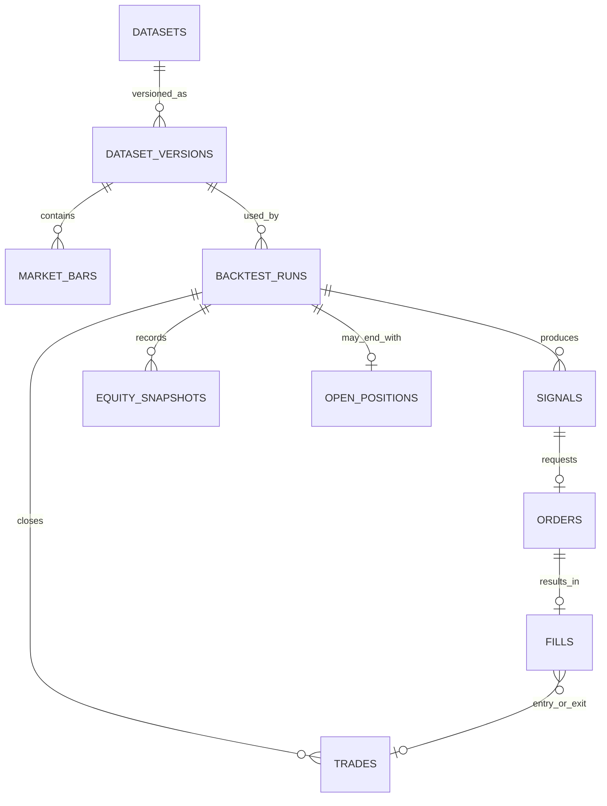

# PostgreSQL Schema — Backtest HPG

Cập nhật: 11/09/2026.

## 1. Quyết định storage

Lấy PostgreSQL làm core storage. Tuy nhiên Backtest core không import PostgreSQL driver/ORM. Application dùng repository interfaces để:

- lấy immutable dataset version;
- tạo và cập nhật backtest run;
- persist/reload complete `BacktestResult`;
- list/filter run history cho Web UI.

Raw files và export lớn nằm sau artifact-storage interface. PostgreSQL giữ URI, content hash và metadata; không copy cùng một file vào mỗi run.

## 2. Relationships

## 3. Tables

Các type dưới đây là target PostgreSQL schema. `numeric` được dùng cho monetary
records; indicator calculation precision/rounding phải được chốt trong coding
conventions trước implementation.

### `datasets`

| Column      | Type        | Constraint/meaning |
| ----------- | ----------- | ------------------ |
| id          | uuid        | PK                 |
| name        | text        | NOT NULL           |
| description | text        | nullable           |
| created_at  | timestamptz | NOT NULL           |

### `dataset_versions`

| Column                  | Type        | Constraint/meaning           |
| ----------------------- | ----------- | ---------------------------- |
| id                      | uuid        | PK                           |
| dataset_id              | uuid        | FK datasets, NOT NULL        |
| version                 | text        | NOT NULL                     |
| content_hash            | text        | NOT NULL, immutable identity |
| source                  | text        | NOT NULL                     |
| timeframe               | text        | NOT NULL;`1D` cho v0       |
| timezone                | text        | NOT NULL                     |
| currency                | text        | NOT NULL                     |
| price_unit              | text        | NOT NULL                     |
| price_adjustment        | text        | NOT NULL                     |
| volume_adjustment       | text        | NOT NULL                     |
| corporate_action_policy | text        | NOT NULL                     |
| raw_artifact_uri        | text        | nullable                     |
| extracted_at            | timestamptz | NOT NULL                     |
| created_at              | timestamptz | NOT NULL                     |

Unique: `(dataset_id, version)` và `content_hash`.

### `market_bars`

| Column             | Type          | Constraint/meaning                         |
| ------------------ | ------------- | ------------------------------------------ |
| dataset_version_id | uuid          | FK dataset_versions                        |
| symbol             | text          | NOT NULL                                   |
| trading_date       | date          | NOT NULL                                   |
| open               | numeric(24,6) | nullable cho index contract chỉ có Close |
| high               | numeric(24,6) | nullable cho index contract chỉ có Close |
| low                | numeric(24,6) | nullable cho index contract chỉ có Close |
| close              | numeric(24,6) | NOT NULL,`> 0`                           |
| volume             | numeric(30,6) | nullable theo instrument contract,`>= 0` |

Primary key: `(dataset_version_id, symbol, trading_date)`.

HPG validation vẫn yêu cầu đủ OHLCV; nullable database columns chỉ cho phép cùng
table chứa instrument contract như VN-Index Close.

### `backtest_runs`

| Column              | Type          | Constraint/meaning                             |
| ------------------- | ------------- | ---------------------------------------------- |
| id                  | uuid          | PK, public`run_id`                           |
| dataset_version_id  | uuid          | FK dataset_versions, NOT NULL                  |
| strategy_id         | text          | NOT NULL                                       |
| engine_version      | text          | NOT NULL                                       |
| start_date          | date          | NOT NULL                                       |
| end_date            | date          | NOT NULL                                       |
| initial_cash        | numeric(24,6) | NOT NULL,`> 0`                               |
| config              | jsonb         | NOT NULL; fee/slippage và run options         |
| strategy_parameters | jsonb         | NOT NULL; snapshot parameters                  |
| status              | text          | `pending/running/succeeded/failed/cancelled` |
| error_code          | text          | nullable                                       |
| error_detail        | jsonb         | nullable                                       |
| created_at          | timestamptz   | NOT NULL                                       |
| started_at          | timestamptz   | nullable                                       |
| completed_at        | timestamptz   | nullable                                       |

Query-critical fields không được giấu trong `config`. JSONB dành cho metadata linh
hoạt nhưng có schema validation ở application boundary.

### `signals`

| Column      | Type          | Constraint/meaning                          |
| ----------- | ------------- | ------------------------------------------- |
| id          | uuid          | PK                                          |
| run_id      | uuid          | FK backtest_runs, NOT NULL                  |
| sequence_no | bigint        | NOT NULL, deterministic order trong run     |
| signal_time | date          | NOT NULL                                    |
| side        | text          | `BUY/SELL`                                |
| reason      | text          | NOT NULL                                    |
| pivot       | numeric(24,6) | nullable                                    |
| details     | jsonb         | indicator/reference values dùng để audit |

Unique: `(run_id, sequence_no)`.

### `orders`

| Column           | Type   | Constraint/meaning                                |
| ---------------- | ------ | ------------------------------------------------- |
| id               | uuid   | PK                                                |
| run_id           | uuid   | FK backtest_runs, NOT NULL                        |
| signal_id        | uuid   | FK signals, UNIQUE, NOT NULL                      |
| created_time     | date   | NOT NULL                                          |
| side             | text   | `BUY/SELL`                                      |
| status           | text   | `pending/filled/rejected/unfilled`              |
| quantity         | bigint | nullable until sizing resolves; positive when set |
| rejection_reason | text   | nullable                                          |
| sizing_details   | jsonb  | risk budget, unit risk, risk/affordable quantity  |

### `fills`

| Column     | Type          | Constraint/meaning          |
| ---------- | ------------- | --------------------------- |
| id         | uuid          | PK                          |
| run_id     | uuid          | FK backtest_runs, NOT NULL  |
| order_id   | uuid          | FK orders, UNIQUE, NOT NULL |
| fill_time  | date          | NOT NULL                    |
| side       | text          | `BUY/SELL`                |
| quantity   | bigint        | NOT NULL,`> 0`            |
| fill_price | numeric(24,6) | NOT NULL,`> 0`            |
| fee        | numeric(24,6) | NOT NULL,`>= 0`           |

Một order v0 có tối đa một full fill; partial fill ngoài scope.

### `trades`

| Column           | Type          | Constraint/meaning         |
| ---------------- | ------------- | -------------------------- |
| id               | uuid          | PK                         |
| run_id           | uuid          | FK backtest_runs, NOT NULL |
| entry_fill_id    | uuid          | FK fills, UNIQUE, NOT NULL |
| exit_fill_id     | uuid          | FK fills, UNIQUE, NOT NULL |
| quantity         | bigint        | NOT NULL,`> 0`           |
| entry_value      | numeric(24,6) | NOT NULL                   |
| exit_value       | numeric(24,6) | NOT NULL                   |
| total_fees       | numeric(24,6) | NOT NULL                   |
| net_realized_pnl | numeric(24,6) | NOT NULL                   |
| close_reason     | text          | NOT NULL                   |

Chỉ position đã exit mới tạo row `trades`.

### `equity_snapshots`

| Column         | Type          | Constraint/meaning |
| -------------- | ------------- | ------------------ |
| run_id         | uuid          | FK backtest_runs   |
| trading_date   | date          | NOT NULL           |
| cash           | numeric(24,6) | NOT NULL           |
| quantity       | bigint        | NOT NULL,`>= 0`  |
| market_value   | numeric(24,6) | NOT NULL           |
| equity         | numeric(24,6) | NOT NULL           |
| unrealized_pnl | numeric(24,6) | NOT NULL           |

Primary key: `(run_id, trading_date)`.

### `open_positions`

Chỉ có row khi run kết thúc với position mở.

| Column         | Type          | Constraint/meaning   |
| -------------- | ------------- | -------------------- |
| run_id         | uuid          | PK, FK backtest_runs |
| entry_fill_id  | uuid          | FK fills, UNIQUE     |
| quantity       | bigint        | NOT NULL,`> 0`     |
| entry_pivot    | numeric(24,6) | NOT NULL             |
| stop_reference | numeric(24,6) | NOT NULL             |
| market_value   | numeric(24,6) | NOT NULL             |
| unrealized_pnl | numeric(24,6) | NOT NULL             |

## 4. Core invariants

- Không có order nếu không có signal; không có fill nếu không có order.
- `filled` order có đúng một fill; rejected/unfilled order không có fill.
- Signal vẫn tồn tại khi order bị reject/unfilled.
- Mỗi run có tối đa một open position tại một thời điểm.
- `cash + market_value = equity` theo accounting precision đã chốt.
- `succeeded` run tham chiếu immutable dataset version và có lịch sử hoàn ất
- Không có rule chỉnh sửa lịch sử cũ, chỉ có thêm vào, sửa rule/data thì tạo run/version mới nên các record cũ không đổi.

## 5. Transaction boundary

- Tạo run/status có thể commit riêng để quan sát lifecycle.
- Khi core thành công, persist toàn bộ child result và chuyển sang `succeeded` trong
  một transaction ngắn.
- Nếu transaction rollback, run không được mang status `succeeded`.
- Failed run lưu error; partial business result không hiển thị như success.

## 6. Indexes ban đầu

- `backtest_runs(status, created_at desc)`.
- `backtest_runs(dataset_version_id, strategy_id, created_at desc)`.
- `signals(run_id, signal_time)`.
- `orders(run_id, status)`.
- `fills(run_id, fill_time)`.
- `trades(run_id)`.
- `equity_snapshots(run_id, trading_date)` đã được cover bởi primary key.
- `market_bars(dataset_version_id, symbol, trading_date)` đã được cover bởi primary
  key.

Chỉ tạo GIN index trên JSONB khi có query thật cần search key/value; không index mọi
JSONB từ đầu.

## 7. Scale path

- Bắt đầu bằng regular tables và indexes trên PostgreSQL.
- Chỉ partition `market_bars` hoặc `equity_snapshots` khi đo được table đủ lớn và
  query/retention hưởng lợi; partitioning không phải default cho dataset HPG daily.
- Khi backtest chuyển sang async, giữ nguyên `backtest_runs.status` và thêm worker/
  queue qua application boundary.
- Khi có multi-user, thêm owner/tenant foreign key và authorization ở API;
  không nhét quyền truy cập vào domain strategy.
- Backup, restore drill, retention và artifact lifecycle phải được định nghĩa trước
  production deployment.

## 8. Migration rule

Schema được quản lý bằng versioned migrations từ đầu. Không sửa production schema
thủ công và không để ORM tự tạo/alter schema khi service khởi động. Công cụ migration
chỉ được chọn sau khi Python persistence stack được chốt.
