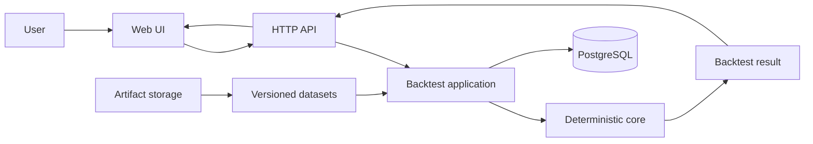
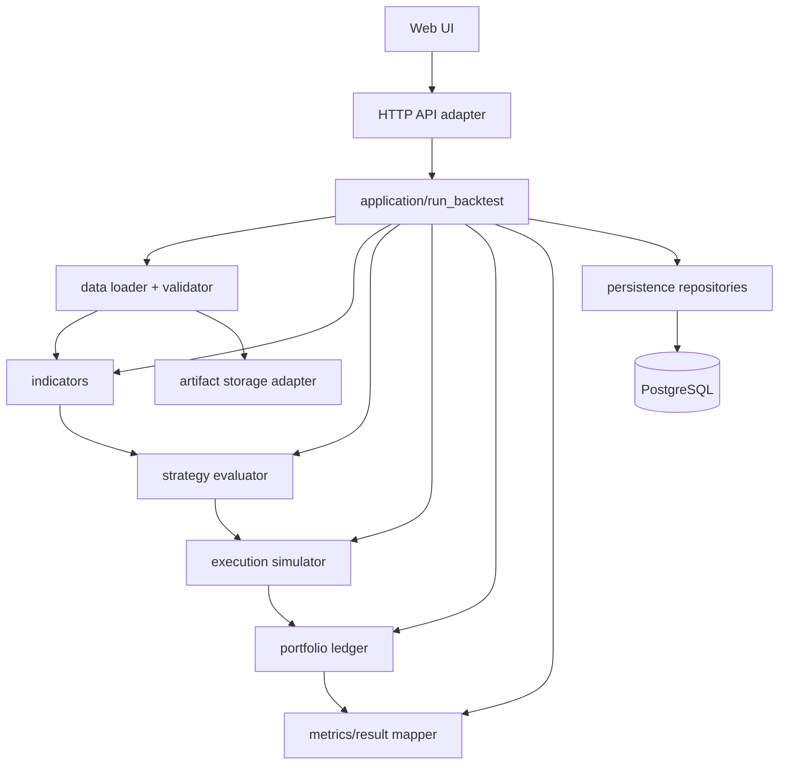
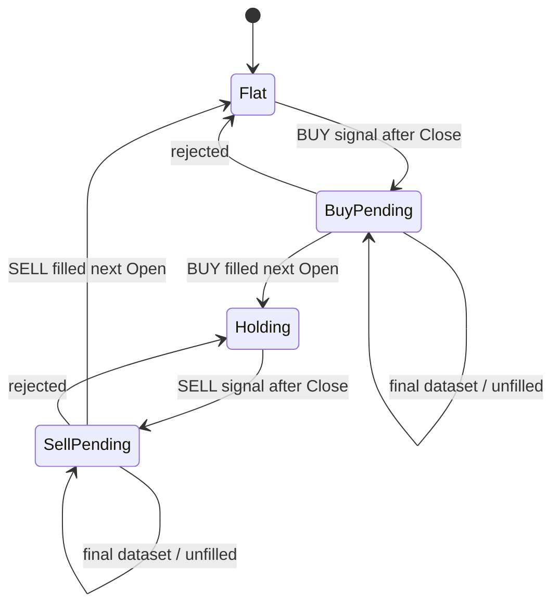
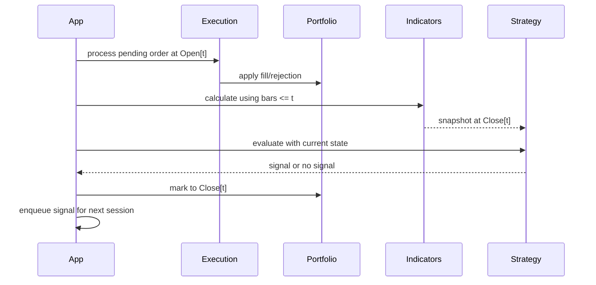
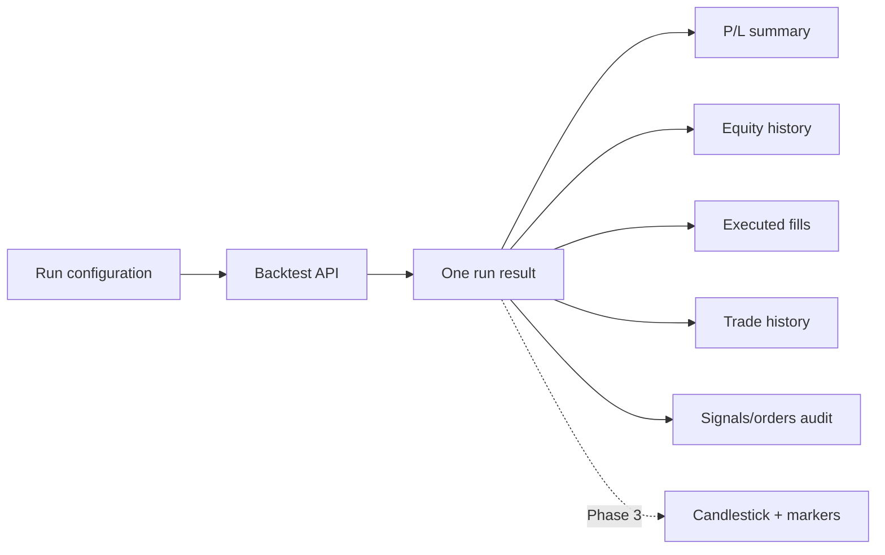

# System Design — Backtest HPG v0 (legacy implementation)

> Target data đã chuyển sang VN30F1M 5 phút và storage plan sang Parquet + JSON (18/09); metadata/session agent c?n ch? ch?t.
> Xác nhận 17/09: giữ CANSLIM, VN-Index R1 và accounting normalized như baseline;
> **18/09:** strategy/execution chính dùng 5 phút, 1D chỉ hỗ trợ; mapping indicator,
> session và support data chờ [C01–C06](../../.agents/checklists/vn30f1m-backtest-checklist.md). Xem
> [Technical Plan hiện hành](../plans/technical-plan.md); phần dưới mô tả source chưa migrate.

Cập nhật: 15/09/2026.

**Adaptation 18/09 theo C04/C06 mới:** timestamp nguồn = Open; Close/available_at
= Open + 5 phút (assumption mô phỏng cả ATC). Engine nhận Open/Close time riêng,
ghi signal/equity tại Close và fill tại Open bar kế tiếp. Chuỗi market độc lập,
SMA200 dùng 200 market samples đã available. Report 15/03–15/09 theo ngày Open
UTC+7. Static policy session/rollover bắt buộc trước core theo C05. Composition
root local intraday dùng Parquet + JSON; root PostgreSQL daily giữ compatibility.

Target 18/09: tái sử dụng luồng API → application → deterministic core → repository
→ result; notebook gọi cùng API, chưa cần agent. Timestamp intraday phải giữ offset
qua model/serialization/storage; không ép về date-only. Support data được chọn theo
available_at tại decision, không lặp daily bar thành nhiều mẫu để tính indicator.
Equity ghi sau mỗi Close bar 5 phút hợp lệ. Session/gap/14:45 chờ C04–C05.
Thiết kế daily bên dưới là mô tả baseline, chưa phải runtime VN30F1M.

## 1. Design goals

- Correct-by-construction về timing và không look-ahead.
- Có thể kiểm thử từng layer bằng fixture nhỏ.
- Rule strategy không phụ thuộc framework hoặc backtest library bên ngoài.
- Mỗi run có thể tái lập và audit.
- Đủ nhỏ cho Phase 1 nhưng có boundary để mở rộng Phase 2.

## 2. Context

Backend Phase 1 chạy đồng bộ trong một process và persist lịch sử vào PostgreSQL;
chưa cần queue hoặc background worker. Web UI chỉ trình bày result do API trả về
hoặc reload từ database. Theo điều chỉnh 15/09, phần nến và fill marker thuộc
Phase 3 được ưu tiên cho đợt push Docker/notebook/chart trước Phase 2; thiết kế
triển khai dự kiến trong [kế hoạch chart](../plans/candlestick-ui-plan.md).

## 3. Container/module view

| Module      | Input                                      | Output                                          |
| ----------- | ------------------------------------------ | ----------------------------------------------- |
| data        | Raw snapshot + metadata                    | Validated aligned daily bars                    |
| indicators  | Bars through`t`                          | Indicator snapshot at`t` hoặc warm-up status |
| strategy    | Indicator snapshot + portfolio/order state | Zero hoặc one signal                           |
| execution   | Pending order + Open + portfolio/config    | Order result/fill + portfolio event             |
| portfolio   | Fill và Close                             | Immutable ledger/snapshot                       |
| metrics     | Ledger, signals, orders, config            | Result DTO                                      |
| application | Run request                                | Result hoặc structured error                   |
| repository  | Dataset/run/result entities                | Persisted/reloaded aggregate                   |
| PostgreSQL  | Relational records + JSONB metadata        | Durable queryable history                      |
| artifact storage | Raw snapshots và large exports       | Immutable object URI/hash                      |
| API         | HTTP request/result DTO                    | Stable JSON contract                           |
| Web UI      | API result                                 | Summary, equity, fills, position và trades     |

Không module domain nào được import từ API, Web UI hoặc storage adapter.

Physical package mapping:

| Boundary | Source package |
| --- | --- |
| HTTP API adapter | `backtest_hpg/api/` |
| Application use case và repository port | `backtest_hpg/application/` |
| Models, engine, portfolio, indicators và strategy registry | `backtest_hpg/domain/` |
| PostgreSQL adapter | `backtest_hpg/infrastructure/database.py` |
| Static backend settings | `backtest_hpg/config.py` |
| Composition root | `backtest_hpg/main.py` |
| Web UI | `backtest_hpg/web/` |

Luồng code của một request là `main -> api -> application -> strategy registry ->
domain engine`, còn application gọi repository port được implement bởi
`infrastructure/database.py`.

## 4. Domain state

Signal, pending order và fill là ba record khác nhau. State transition chỉ xảy ra
khi execution tạo fill hợp lệ.

## 5. Sequence của một session

Không được precompute rồi expose indicator tương lai cho strategy. Có thể tính
rolling vectorized nếu test chứng minh mỗi giá trị `t` chỉ phụ thuộc `<= t`.

## 6. Position sizing boundary

Strategy chỉ tạo BUY intent. Execution tính quantity đúng một lần tại Open từ:

- equity/cash trước fill;
- entry fill price đã gồm entry slippage;
- stop distance 7%;
- risk fraction 2%;
- affordability đã gồm entry fee.

Quantity dưới 1 làm order bị reject, không xóa BUY signal. Risk 2% là nominal risk
tới stop reference; Close-based exit và gap có thể làm realized loss lớn hơn.

## 7. Error model

| Nhóm                | Ví dụ                                                  | Hành vi                                                |
| -------------------- | -------------------------------------------------------- | ------------------------------------------------------- |
| Input error          | Sai schema, OHLC invalid, duplicate date                 | Dừng run, trả structured validation error             |
| Unevaluable strategy | Chưa đủ warm-up hoặc thiếu required value tại`t` | Không sinh signal, ghi reason                          |
| Execution rejection  | Quantity dưới 1 hoặc không đủ cash                 | Giữ signal, ghi rejected order                         |
| Missing next bar     | Signal cuối kỳ                                         | Giữ pending/unfilled record                            |
| Internal invariant   | Cash âm ngoài tolerance, position âm                  | Fail run; không trả kết quả thành công một phần |

## 8. Test architecture

- Unit: validator, từng indicator, strategy boundaries, sizing và accounting.
- State-machine: buy/sell pending, reject, final bar và same-session transitions.
- Integration: dataset fixture → complete result.
- Causality: full input so với input truncate tại nhiều mốc `t`.
- Determinism: serialize result của hai run cùng input và so sánh sau khi loại bỏ
  run ID không deterministic; ưu tiên run ID content-derived.

## 9. Persistence flow

1. API/application tạo `backtest_run` với status `pending` rồi `running`.
2. Core nhận immutable dataset version và chạy hoàn toàn ngoài transaction dài.
3. Khi core thành công, repository mở một transaction ngắn để ghi signals, orders,
   fills, trades, position/equity history và chuyển run sang `succeeded`.
4. Nếu core hoặc persistence lỗi, run chuyển `failed` với structured error; Web UI
   không xem partial child records như kết quả thành công.
5. `GET` history chỉ trả run `succeeded` theo mặc định; audit có thể xem failed run.

Raw source snapshot/export lớn không nhân bản vào từng run. Run tham chiếu một
immutable `dataset_id/version/content_hash`. Query-critical fields nằm ở relational
columns; strategy/config metadata linh hoạt có thể nằm trong JSONB.

## 10. Evolution path

- Strategy registry tối thiểu đã tồn tại; Phase 2 thêm strategy module mới sau khi
  interface signal ổn định và phải giữ regression result của v0.
- Repository adapter cho phép thay đổi storage implementation mà không đổi domain
  core; PostgreSQL là implementation production đã chọn.
- Queue/worker có thể được thêm sau qua application boundary khi thời gian chạy hoặc
  concurrency yêu cầu, không đổi result schema.
- Engine/library bên ngoài chỉ được thêm qua adapter và phải pass cùng contract
  tests; library semantics không được override project semantics.
- Multi-symbol/multi-position yêu cầu thiết kế lại portfolio và event ordering,
  không mở rộng ngầm từ implementation v0.

## 11. Web UI data flow

Ở bước hiện tại, UI dùng cards/tables và có thể dùng equity line đơn giản. Chart nến
và marker trực quan thuộc Phase 3, được kéo sớm theo kế hoạch 15/09. Khi thêm chart, marker phải dùng `fills`, không
dùng signal làm bằng chứng giao dịch. Chi tiết nằm trong
[web-ui-specification.md](web-ui-specification.md).
