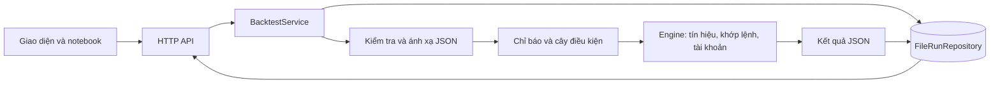
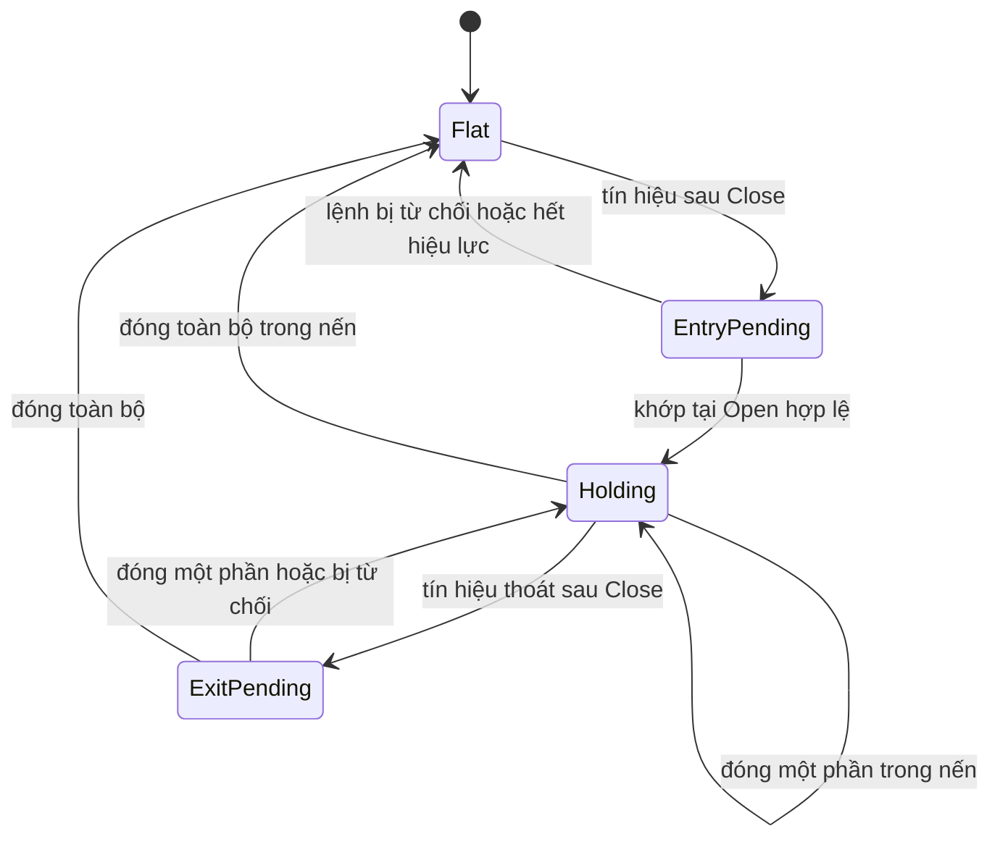

# Thiết kế hệ thống — Backtesting API

## 1. Mục tiêu và luồng xử lý

Ứng dụng đồng bộ nhận JSON và đi qua các lớp:
`data → indicator → strategy evaluation → signal → execution → portfolio → metrics`.
Giao diện và notebook gọi cùng API; domain không chọn rule dựa trên tên symbol.
Quy tắc thuộc [hướng dẫn JSON](strategy-payload-guide.md),
[CANSLIM v1](../strategies/canslim-v1-rules.md) và
[accounting](canslim-v1-execution-accounting.md).


```mermaid
flowchart LR
    UI[Giao diện và notebook] --> API[HTTP API]
    API --> APP[BacktestService]
    APP --> DATA[Kiểm tra và ánh xạ JSON]
    DATA --> STRAT[Chỉ báo và cây điều kiện]
    STRAT --> ENGINE[Engine: tín hiệu, khớp lệnh, tài khoản]
    ENGINE --> RESULT[Kết quả JSON]
    APP --> STORE[(FileRunRepository)]
    RESULT --> STORE
    STORE --> API
```

## 2. Ranh giới module

| Thành phần | Source | Trách nhiệm |
| --- | --- | --- |
| Điểm khởi chạy | `backtesting_api/main.py` | Nối repository, bộ chạy JSON, chính sách và FastAPI |
| HTTP | `api/app.py`, `api/backtest_routes.py`, `api/inline_schemas.py` | Kiểm tra yêu cầu và ánh xạ lỗi HTTP |
| Điều phối | `application/run_backtest.py`, `application/ports.py` | Kiểm tra, chạy, lưu và đọc qua một repository |
| Dữ liệu | `application/inline_data.py`, `infrastructure/market_snapshot.py` | Ánh xạ và kiểm tra OHLCV, thời gian, map hợp đồng |
| Chiến lược JSON | `application/inline_strategy.py`, `domain/expressions.py`, `domain/indicators.py` | Chỉ báo, biểu thức, điều kiện và trạng thái chiến lược |
| Thực thi và tiền | `domain/engine.py`, `execution.py`, `portfolio.py`, `contract_accounting.py` | Điều phối thời gian, khớp lệnh và sổ tài khoản |
| Kết quả | `application/inline_results.py`, `domain/results.py` | Chuyển kết quả engine thành JSON |
| Kho file | `infrastructure/file_repository.py` | Ghim đầu vào, lưu/đọc kết quả và dựng dữ liệu chart |
| Giao diện | `web/` | Trình bày cùng một kết quả từ API |

Domain không import API, application, infrastructure hoặc web. Chiến lược được
khai báo bằng chỉ báo/biểu thức trong JSON; không thực thi mã Python do HTTP gửi.
Cấu trúc đầy đủ tại [cấu trúc repository](project-structure.md).

## 3. Thời gian, tín hiệu và trạng thái

Engine xử lý các bước tại nến: thực thi lệnh chờ ở Open → áp dụng fill/rejection
→ xử lý thoát trong nến theo rule → ghi tài khoản tại Close → đánh giá điều kiện
bằng dữ liệu đã khả dụng → tạo tín hiệu/lệnh chờ cho Open kế tiếp.
Dữ liệu thị trường được ghép theo available_at, không theo chỉ số dòng.


```mermaid
stateDiagram-v2
    [*] --> Flat
    Flat --> EntryPending: tín hiệu sau Close
    EntryPending --> Holding: khớp tại Open hợp lệ
    EntryPending --> Flat: lệnh bị từ chối hoặc hết hiệu lực
    Holding --> ExitPending: tín hiệu thoát sau Close
    Holding --> Holding: đóng một phần trong nến
    Holding --> Flat: đóng toàn bộ trong nến
    ExitPending --> Holding: đóng một phần hoặc bị từ chối
    ExitPending --> Flat: đóng toàn bộ
```

Signal, order và fill là record khác nhau. Không có fill thì không được tạo
trade hoặc thay đổi vị thế như đã giao dịch. Sizing sử dụng giá/thông tin tại
lúc thực thi, theo nhóm sizing/accounting trong JSON. Normalized và contract
là hai mô hình tiền hiện hỗ trợ; các giới hạn cụ thể thuộc đặc tả API.

IndicatorData chuẩn bị chuỗi nhưng mỗi lần đánh giá chỉ đọc phần đã khả dụng.
Thiếu lịch sử hoặc dữ liệu bắt buộc tại t phải ghi UNEVALUABLE. Không lặp nến
tham chiếu, không tự điền gap, không ghép giá hợp đồng tương lai để tính quá khứ.

## Các trường hợp lỗi và phục hồi theo luồng


Bảng này đặt lỗi tại đúng layer để không lẫn trách nhiệm giữa data, strategy,
execution, portfolio và repository. Mã `SDD-EX-*` là điểm nối cho state-machine
test và integration test.

| Case ID       | Điểm phát sinh                                                                | Ảnh hưởng trạng thái/dữ liệu                                                                           | Hành động hệ thống                                                                                     |
| ------------- | -------------------------------------------------------------------------------- | ------------------------------------------------------------------------------------------------------------- | ----------------------------------------------------------------------------------------------------------- |
| `SDD-EX-01` | Data loader/validator gặp schema, OHLC, thứ tự hoặc metadata sai             | Chưa được phép vào indicator/strategy; chưa có signal hoặc fill hợp lệ                             | Dừng run và trả structured validation error; không tự sửa hoặc điền dữ liệu                      |
| `SDD-EX-02` | Indicator/strategy thiếu warm-up hoặc required value tại`t`                 | Chỉ lần đánh giá hiện tại không có signal; state vị thế giữ nguyên                               | Ghi reason unevaluable và tiếp tục các bar hợp lệ sau đó                                            |
| `SDD-EX-03` | Execution nhận pending nhưng không có Open kế tiếp hợp lệ                | Order ghi trạng thái chưa khớp hoặc cuối kỳ theo cấu hình; không phát sinh fill hoặc thay đổi position                               | Ghi trạng thái cuối kỳ/missing next bar theo result contract; không tạo giá giả                     |
| `SDD-EX-04` | Execution hoặc ledger từ chối order do quantity/cash/side/fee                 | Signal vẫn tồn tại; order rejected; position và ledger không đổi bởi fill                             | Ghi order outcome/reason, chuyển sang bước mark/evaluate kế tiếp                                       |
| `SDD-EX-05` | Core phát hiện invariant sai như cash âm ngoài tolerance hoặc position âm | Run không còn đủ điều kiện thành công; child records không được xem là result hoàn chỉnh      | Đánh dấu failed với structured error; không trả partial result thành công                           |
| `SDD-EX-06` | Repository không ghi atomically hoặc artifact/result sai hash/schema khi đọc | Không được công bố aggregate succeeded; dữ liệu lỗi không được dùng làm result                 | Công bố từng tệp bằng thay thế nguyên tử; không công bố kết quả thiếu, từ chối tệp sai khi đọc |
| `SDD-EX-07` | Evaluator có nguy cơ nhìn thấy dữ liệu sau decision hoặc full array       | Có nguy cơ làm sai signal, fill và tính tái lập                                                        | Chỉ truyền prefix/record có`available_at <= decision`; causality test phải chặn vi phạm             |
| `SDD-EX-08` | Service restart sau khi run đã thành công hoặc failed                       | Run thành công phải giữ được business result; run failed không xuất hiện trong history thành công | Repository reload theo hash/schema; API chỉ đọc succeeded; trạng thái failed được lưu trong tệp run để đối chiếu            |

## 4. Kho file và trạng thái lượt chạy

`BACKTEST_STORE_PATH` mặc định `data/backtest-store`:

```text
backtest-store/
├── inputs/<input_hash>.json       # JSON đầy đủ, chính sách và metadata dữ liệu
├── runs/<run_id>.json             # running / failed / succeeded và kết quả
├── datasets/                     # Dataset/Parquet đã ghim cho lịch sử phiên bản 1
└── policies/                     # Chính sách của lịch sử đã có
```

`start_inline()` ghi đầu vào, tính input_hash/policy_hash và tạo run running.
Core chạy trong bộ nhớ; `complete_run()` kiểm tra run/input và công bố toàn bộ
kết quả succeeded bằng thay tệp nguyên tử, kèm result_hash. Lỗi sau khi tạo run
được lưu bằng `fail_run()`. Đây là công bố từng tệp, không phải giao dịch nhiều
file; run chỉ thành công khi tệp kết quả đầy đủ đã được công bố.

`get_run()` kiểm tra phiên bản, trạng thái, run_id, hash kết quả và đầu vào/chính
sách của phiên bản 2. `list_runs()` chỉ trả succeeded, theo tên tệp giảm dần;
không coi thứ tự UUID là thứ tự thời gian tạo. API không cung cấp danh sách failed.
`get_input()` phục vụ kết quả phiên bản 2; lịch sử phiên bản 1 không có input JSON
này và trả lỗi tương thích khi gọi endpoint input.

Chart phiên bản 2 dựng từ đầu vào đã ghim; không chạy lại chiến lược hoặc gọi
nguồn ngoài. Trường open_time của một đầu vào lịch sử được ánh xạ khi đọc trên
bản sao; JSON mới vẫn bắt buộc time. Chart phiên bản 1 đọc manifest và nến
Parquet của lịch sử còn giữ; pyarrow phục vụ nhánh đọc này.

Kho có một tiến trình ghi. Đường dẫn chính sách/kho file tương đối được xác
định từ thư mục làm việc; chạy ứng dụng từ gốc repository theo
[runbook](../plans/vn30f1m-backtest-runbook.md).

## 5. Giao diện và đọc kết quả

API trả một result cho mỗi run. Summary, chart, fill marker, bảng giao dịch,
vị thế mở, audit và equity đều dùng cùng run_id/hash. Frontend chỉ định dạng
và lọc record, không tính lại chỉ báo hoặc tiền. Lỗi chart không tạo lượt chạy
mới; nút thử lại đọc kết quả/chart theo run_id đã có.
Chi tiết tại [đặc tả giao diện](web-ui-specification.md).

## 6. Kiểm thử và mở rộng

Kiểm thử các lớp dữ liệu/biểu thức, trạng thái lệnh, tính tiền, lỗi ghi nguyên
tử, hash/schema, đọc lịch sử, API, notebook và ánh xạ chart. Đối chiếu đầy đủ
với dữ liệu cắt tại t và dữ liệu tương lai bị thay đổi; chạy cùng JSON nhiều
lần phải giữ kết quả nghiệp vụ sau khi tách UUID.

Agent/MCP là thiết kế dự kiến tại [kế hoạch agent](../plans/agent-research-plan.md),
chưa tham gia luồng thực thi. Chưa có queue, nhiều tiến trình ghi hoặc kho phiên
agent được chọn. Mở rộng phải dùng cùng kiểm tra JSON và application boundary.
