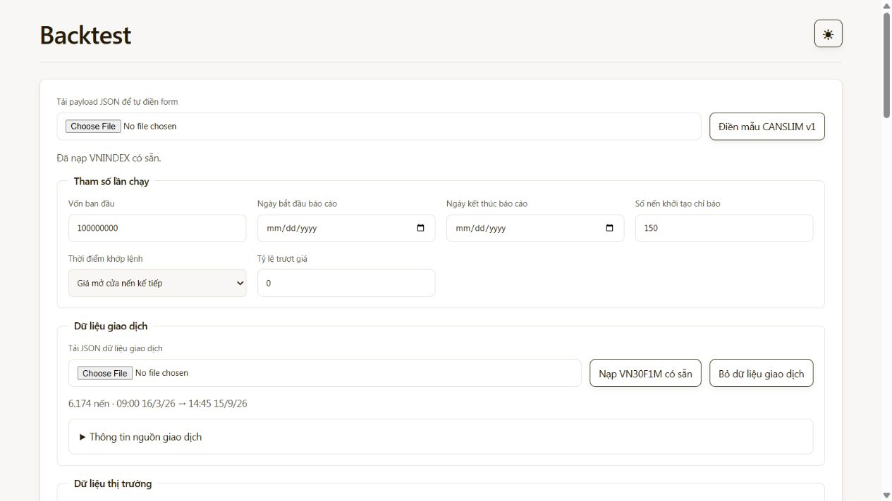
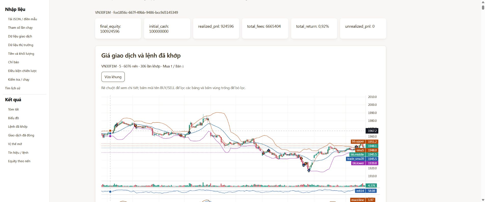

# Đặc tả giao diện — Backtesting API

## 1. Phạm vi hiện tại

Trang `/` có form tham số, tải payload JSON để tự điền form, nút điền mẫu,
kiểm tra và chạy. Điều kiện chiến lược dùng các ô JSON nhỏ, không chứa dữ liệu giá.
Giao diện mở lại kết quả từ lịch sử, hiển thị summary, nến, khối lượng, chỉ báo,
marker giao dịch, equity và bảng đối chiếu. Notebook dùng cùng API.
Giao diện không tính lại chiến lược, chỉ báo hoặc tiền; dữ liệu thuộc cùng một run.

## 2. Luồng người dùng

1. Khi mở trang, hiện các trường nhưng chưa tự chọn chiến lược hoặc tải nến.
   Điền mẫu CANSLIM v1 hoặc tải payload JSON để điền cấu hình; mẫu chỉ minh họa
   cấu trúc và chứa 2 nến mỗi nguồn. Nếu đã nạp dữ liệu, điền mẫu giữ các nguồn đó.
2. Kiểm tra bằng `POST /api/backtests/validate`; STRUCTURE_VALID không bảo đảm
   mọi nến đã đủ lịch sử chỉ báo.
3. Chạy bằng `POST /api/backtests`; submit khóa trong khi chờ để tránh gửi trùng.
4. Hiển thị result và tải chart theo `metadata.run_id`; không tự tải lại lịch sử.
5. Khi mở trang, lịch sử chỉ hiện bộ lọc, chưa tải danh sách hoặc kết quả cũ.
6. Bấm Tìm lịch sử để lọc theo khoảng tỷ suất sinh lời (%) và vốn cuối kỳ
   (`final_equity`). Các giới hạn không bắt buộc; hai khoảng kết hợp bằng AND,
   có tính cả hai đầu khoảng. Vốn giữ đơn vị của từng lần chạy, không đổi VND
   sang đơn vị giá của mô hình normalized.
7. Danh sách chỉ tải 20 tóm tắt mỗi trang trong bảng, hiển thị symbol,
   ngày bắt đầu và ngày kết thúc ở hai cột riêng, tỷ suất
   sinh lời và vốn cuối kỳ; UUID chỉ hiện khi rê chuột lên dòng, không làm tên kết quả.
   Vốn cuối kỳ chỉ hiển thị số, không thêm hậu tố đơn vị.
   Trang tiếp giữ bộ lọc và thay trang hiện tại; bấm Tìm lịch sử để về trang đầu.
8. Bấm dòng trong bảng hoặc nút Xem mới tải kết quả và chart bằng GET, không
   chạy lại chiến lược. Nút Xem hỗ trợ điều khiển bằng bàn phím.
   Chưa có bộ lọc nâng cao.

### Vùng nhập cấu hình và dữ liệu

Ảnh minh họa phần đầu của form sau khi điền mẫu và nạp hai nguồn có sẵn:

- Form có vốn ban đầu, ngày bắt đầu/kết thúc báo cáo, số nến khởi tạo chỉ báo,
  thời điểm khớp lệnh và trượt giá. Hai ngày báo cáo cùng bỏ trống hoặc cùng có giá trị.
- Chọn mô hình normalized/contract và cách tính khối lượng để hiện các tham số
  tương ứng. Khi đổi mô hình hoặc loại chỉ báo, nhập các tham số của lựa chọn mới;
  giao diện không tự đổi điều kiện BUY/LONG/SHORT hoặc ngưỡng chiến lược.
- Chỉ báo có tên, loại, nguồn và tham số; có thể thêm/xóa. Điều kiện `entry`,
  `exit`, `daily_limits` và bảng đáo hạn `contract_map` giữ các ô JSON riêng,
  mỗi ô tối đa 65.536 ký tự. Đây là giới hạn trình soạn trên web, không đổi giới hạn API.
- Tải payload đầy đủ sẽ thay cấu hình và dữ liệu trên form. Tải JSON vào từng nguồn
  chỉ thay nguồn đó, giữ cấu hình và nguồn còn lại. Dữ liệu nhận dạng danh sách nến,
  object `bars`, OHLCV dạng `t/o/h/l/c/v` hoặc phần tương ứng trong payload đầy đủ.
- Nạp VN30F1M có sẵn đọc `data/trade/vn30f1m-5m-20260316-20260915.json` vào
  `trade_data`; nạp VNINDEX có sẵn đọc
  `data/market/VNINDEX_5&from=1772323200&to=1789516800.json` vào `market_data`.
  Hai tài nguyên UI cố định là `GET /ui-data/trade_data` và
  `GET /ui-data/market_data`; không nhận đường dẫn tùy ý, không gọi nguồn bên ngoài.
  Tệp được đọc dưới thư mục `data` của thư mục chạy ứng dụng; Compose đã gắn thư mục
  này. Nếu thiếu tệp, báo lỗi và vẫn cho tải JSON lên.
- Nến nằm trong dữ liệu của form; chỉ hiện số nến và thời gian đầu/cuối, không
  tạo trường nhập cho từng nến và không đưa toàn bộ payload vào textarea.
  Bỏ một nguồn sẽ bỏ dữ liệu và thông tin của nguồn đó.
- Kiểm tra/Chạy ghép lại JSON theo hợp đồng hiện tại. Vốn, tỷ lệ phí và tham số
  thập phân được giữ dạng chuỗi khi chỉnh, tránh làm tròn qua số JavaScript.
  Giá trị và kiểu của trường chưa chỉnh được giữ nguyên khi tải payload lên.
  Không gửi file/multipart hoặc đường dẫn file đến API backtest.
- Trong khi đọc JSON, các nút nạp tạm khóa và Chạy không gửi dữ liệu chưa nạp xong.
  JSON sai không thay cấu hình đang có. Các lỗi kiểm tra chiến lược/dữ liệu vẫn
  do API hiện tại xác định; giao diện không sửa, sắp xếp hoặc tự điền nến thiếu.

## 3. Mapping dữ liệu

| Thành phần | Nguồn | Quy tắc |
| --- | --- | --- |
| Summary | `summary` | Chỉ định dạng số/return |
| Lịch sử | `GET /api/backtests/history` | Lọc tại máy chủ, chỉ nhận tóm tắt theo trang; giữ thứ tự repository |
| Nến và volume | `GET /api/backtests/{run_id}/chart` | Đúng nguồn, kỳ báo cáo, resolution và timezone |
| Chỉ báo | `evaluations` và dữ liệu market của run | Dùng giá trị máy chủ; chỉ hiển thị khi có |
| Marker | `fills` | Giá khớp thật; không dùng signal làm giao dịch |
| Giao dịch đóng | `trades` | Hiển thị quantity, phí và lãi/lỗ đã chốt |
| Vị thế mở | `open_position` | Hiển thị lãi/lỗ chưa chốt riêng |
| Audit | `signals`, `orders` | Giữ trạng thái rejected/pending/filled riêng |
| Equity | `equity_history` | Điểm tại Close, trục riêng với giá nến |

Normalized dùng BUY/SELL; contract dùng LONG/SHORT/CLOSE và thông tin hướng,
mã hợp đồng, phí/thuế/ký quỹ khi có. Không diễn giải normalized quantity thành
số hợp đồng. Các run lịch sử được trình bày theo metadata đã lưu.

## 4. Chart và chọn giao dịch

- Kiểm tra run_id và hash/dataset phù hợp trước khi vẽ; không trộn run cũ/mới.
- Marker neo đúng fill_price; nến chứa fill theo bar_time khi có. Không ép giá
  khớp về High/Low nếu trượt giá đưa fill ra ngoài nến.
- Tooltip lấy reason theo fill.order_id → order.signal_id → signal.reason.
- Chọn marker lọc fills cùng ngày, trade chứa fill, signal/order liên quan,
  vị thế mở từ fill và equity tương ứng. Chọn vùng trống để bỏ lọc.
- Giữ bảng fills để đối chiếu. Rejected/unfilled không có marker.
- Volume và chỉ báo volume không dùng trục giá nến; equity có chart riêng.
- Zoom/scroll/resize không làm marker lệch giá/thời gian; dọn chart/listener khi đổi run.
- Thiếu nến hoặc sai OHLC/hash báo lỗi, không tự điền nến, sort hoặc dời marker.
- Nút thu gọn/mở rộng equity chỉ thay cách trình bày, không sửa dữ liệu.

### Mục lục toàn trang

- Thanh điều hướng dọc ghim sát góc trái trên, cao bằng màn hình, ở cửa sổ từ
  1200 px. Nội dung giữ chiều rộng 1200 px tối đa và căn giữa; chừa lề cân hai
  bên khi cửa sổ hẹp hơn 1600 px để thanh không che hoặc đẩy lệch nội dung.
  Hai tiêu đề Nhập liệu/Kết quả dùng chữ đậm 18 px, đen ở giao diện sáng và
  trắng ở giao diện tối; các liên kết bên trong thụt thêm 12 px.
- Luôn có liên kết đến tải JSON/điền mẫu, tham số lần chạy, dữ liệu giao dịch,
  dữ liệu thị trường, tiền và khối lượng, chỉ báo, điều kiện chiến lược,
  kiểm tra/chạy và tìm lịch sử.
- Chỉ thêm nhóm Kết quả khi có run đang hiển thị: tóm tắt, biểu đồ, lệnh đã khớp,
  giao dịch đã đóng, vị thế mở, tín hiệu/lệnh và equity theo nến.
  Đang tải hoặc tải run lỗi thì ẩn nhóm này; lỗi chart vẫn giữ mục lục kết quả
  nếu dữ liệu bảng đã tải.
- Khi cửa sổ dưới 1200 px, dùng nút Mục lục ghim ở góc dưới bên trái. Nút mở thanh
  dọc phủ tạm lên trang; chọn một mục thì đóng lại và nhảy đến vùng tương ứng.
  Có thể dùng Tab và Enter để điều hướng. Mục lục dài cuộn riêng theo chiều dọc.
- Đã bỏ bố cục chia đôi vùng kết quả và khung cuộn bảng của phương án trước.
  Bảng trở về cách cuộn theo trang; các liên kết đưa về tiêu đề/nút thu gọn.
  Mục lục không thay đổi lượng dữ liệu tải từ API.

## 5. Trạng thái và lỗi

Chưa có run, đang tải, thành công có giao dịch, thành công không giao dịch,
vị thế mở và lỗi phải phân biệt rõ. No-trade không đồng nghĩa đủ dữ liệu đánh giá;
hiển thị evaluation_status khi có.

Controller dùng sequence để bỏ response đến muộn. POST thành công nhưng chart
GET lỗi thì giữ result/bảng đã tải và cho thử lại bằng GET. Lỗi history hiển thị
riêng. Khi result lỗi, ẩn kết quả/chart cũ để không gắn với run mới.
Thông báo API được hiển thị bằng text; không thực thi HTML từ dữ liệu.

## 6. Tài nguyên và giao diện đã chọn

HTML/CSS/JavaScript ES modules đóng gói trong `backtesting_api/web`, được
FastAPI phục vụ cùng origin tại `/static`. Module .mjs dùng MIME text/javascript.
Lightweight Charts và LICENSE/NOTICE được lưu trong `web/vendor`.

Style theo [DESIGN.md](DESIGN.md): nền cream, chữ espresso, nút amber;
light/dark qua nút có nhãn truy cập. Main nối `create_app(..., preview=True)`
để dùng preview.css và preview-theme.mjs cho giao diện chính. Theme lưu bằng
`backtest-preview-theme`, đồng bộ tab và phát themechange; không tải lại run.
Màu nến/hướng giao dịch giữ ý nghĩa đã chọn. Font dùng tài nguyên máy/fallback;
không yêu cầu tải font ngoài để chạy.

## 7. Nghiệm thu

- Form/validate/run/history dùng đúng hợp đồng JSON và endpoint còn hoạt động.
- Các payload mẫu điền và ghép lại không đổi nội dung; chỉnh tham số không đổi
  nến hoặc nguồn còn lại. Hai nguồn có sẵn trùng đúng nội dung file được chỉ định.
- Số trường và tổng chữ trong textarea không tăng theo số nến. Kiểm tra nhập,
  cuộn và Chạy hai lần liên tiếp; RAM giảm không tự chứng minh hết mọi nguyên nhân lag.
- Chart, summary và bảng khớp cùng run/hash; marker đúng số fill và giá/thời gian.
- No-fill, rejected, vị thế mở và lỗi chart được trình bày đúng trạng thái.
- Không tạo POST mới khi thử đọc lại chart; response cũ không thay run đang chọn.
- Tài nguyên đóng gói tải được sau cài đặt/Docker, có attribution của thư viện.
- Mở run sau restart vẫn đọc cùng result; keyboard, label, focus, aria-live và
  bố cục mobile là các mục kiểm tra giao diện.

Các phép kiểm tra và giới hạn bằng chứng tại
[kế hoạch chart](../plans/candlestick-ui-plan.md) và
[checklist tích hợp](../plans/legacy-cleanup-checklist.md).
