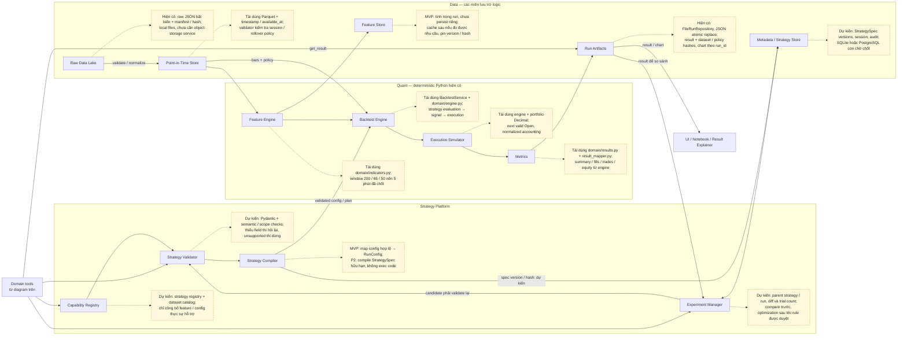
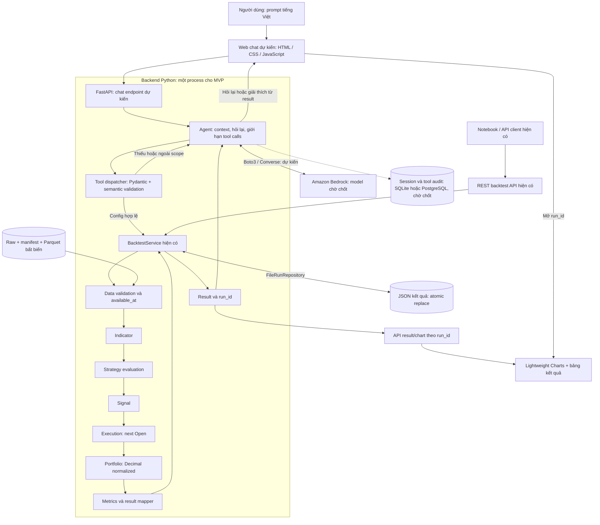
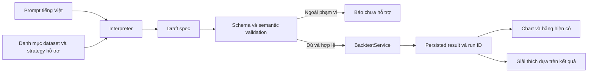

# Research agent và mở rộng backtest

Đây là thiết kế dự kiến; chưa triển khai agent hoặc cài SDK mới.
Tài liệu này phân biệt source hiện có, đề xuất research và điều kiện nghiệm thu;
không phê duyệt thêm strategy hoặc thay scope dữ liệu hiện hành.

## 1. Mục tiêu và hiện trạng đã kiểm tra

Bảng dưới là snapshot kiểm kê ngày 17/09, không phải trạng thái hiện tại.
Đến 21/09, source intraday đã có API, engine timestamp và repository Parquet/JSON;
CANSLIM, VN-Index R1 và normalized accounting đã được chốt. Nghiệm thu đủ kỳ
15/03–15/09 vẫn phụ thuộc history còn thiếu trước 18/03; có source không đồng
nghĩa đã nghiệm thu agent hoặc backtest trên dữ liệu thật đủ kỳ.

Đầu ra mong muốn: người dùng nhập “backtest mã xxx nếu giá vượt ...” hoặc
“dùng thuật toán xxx để backtest”, hệ thống làm rõ yêu cầu, chạy engine và trả
summary, nến, executed fills, trades, equity và metadata như output hiện có.

| Thành phần           | State                            | Bằng chứng tại thời điểm kiểm tra                                                                                                                            |
| ---------------------- | -------------------------------- | ------------------------------------------------------------------------------------------------------------------------------------------------------------------- |
| Kế hoạch agent       | Done (tài liệu)                | P4.1–P4.5 trong backtest-plan-v0.md: danh mục hỗ trợ, tiếng Việt → spec, validation, nối API/chart, demo                                                    |
| Tổng quát hóa       | Not started ở mức StrategySpec | P2.1–P2.4 có kế hoạch; application/contracts.py mới có RunConfig                                                                                              |
| Chọn strategy         | Có nền tảng                   | domain/strategies/__init__.py có registry, mới đăng ký canslim_breakout_v0                                                                               |
| Application/API/result | Có source                       | BacktestService.run/get/list; POST/list/detail /api/backtests; result_mapper.py                                                                                     |
| Phạm vi source        | Legacy HPG daily                 | config.py giới hạn HPG; domain/market.py dùng date; request chưa nhận entry/exit tùy chọn                                                                    |
| Persistence            | Source PostgreSQL                | infrastructure/database.py;[Parquet + JSON](technical-plan.md#6-persistence-parquet-json) là target 18/09; metadata/session SQLite hoặc PostgreSQL còn chờ chốt |
| Chart snapshot VN30F1M | Done trong lượt 17/09          | market-chart.html/mjs, /api/market-chart, vendor 5.2.0; dữ liệu thật và browser đã kiểm tra; chart theo run/marker/equity chưa có                          |
| Agent chạy thật      | Not started                      | Chưa có strategy_agent/, provider, schema/spec interpreter hoặc bộ eval prompt                                                                                  |
| VN30F1M                | Blocked phần nghiệp vụ        | Contract 5 phút đã có; strategy và futures accounting chưa được duyệt                                                                                     |

“Cổ phiếu xxx” là hướng mở rộng ngoài target VN30F1M hiện hành. Agent không tự
mở rộng dữ liệu được hỗ trợ. Chọn một mã cho mỗi run trước; portfolio nhiều mã là
scope riêng, không đồng nghĩa với thay symbol trong prompt.

* [ ] 2. Kiến trúc sản phẩm agent

Tham khảo PDF **DNSE MCP Backtest: phân tích kiến trúc sản phẩm và blueprint để
xây dựng**, trang 3–4 (gateway và storage), 15–19 (tools, workflow và vai trò),
33 (sơ đồ target). File tham khảo nằm trong `local_only_docs/`; tài liệu này ghi
đủ mapping để đọc độc lập với PDF. Kiến trúc DNSE trong PDF là phân tích/suy luận
của tác giả, không phải kiến trúc nội bộ đã được DNSE xác nhận.

Các component dưới đây là **target sản phẩm của project**, còn implementation
là dự kiến. Khuyến nghị trong PDF không tự trở thành yêu cầu triển khai: giữ
VN30F1M 5 phút, CANSLIM đã chốt, VN-Index R1 và normalized accounting; không lấy
daily, rolling six-month window, strategy ví dụ hoặc stack greenfield của PDF
để thay baseline. Yêu cầu lần này cập nhật thiết kế, chưa triển khai runtime.

### 2.1. Component diagram và implementation dự kiến

Hai diagram nối nhau tại **Domain tools**. Mũi tên liền là luồng gọi/dữ liệu;
nét đứt nối note implementation đặt cạnh component. Các vai trò AI dùng chung
một router và một model trước; mỗi box không đồng nghĩa một service hoặc
một autonomous agent riêng.

* [ ] 
  ```mermaid
  flowchart LR
      U["User"] --> UI
      subgraph Client["Client"]
          UI["Own UI"] -.-> NUI["Dự kiến: thêm chat vào HTML / CSS / ES modules;<br/>tái dùng chart và bảng theo run_id"]
          HOST["External AI host"] -.-> NHOST["Dự kiến: client MCP bên ngoài;<br/>chỉ kết nối sau khi có gateway và auth"]
      end
      subgraph AI["AI — một workflow Python"]
          CO["Router"] -.-> NCO["Dự kiến: chọn bước tiếp theo và chuyển yêu cầu;<br/>state, giới hạn lượt gọi, timeout và budget thuộc workflow"]
          RE["Research Module"] -.-> NRE["Dự kiến: đọc coverage / provenance từ tools;<br/>research thị trường mở rộng cần data contract"]
          GE["Strategy Generator"] -.-> NGE["Dự kiến: Bedrock qua provider adapter;<br/>intent → draft config / StrategySpec"]
          EL["Result Explainer"] -.-> NEL["Dự kiến: dùng chung model với generator;<br/>giải thích số liệu lấy từ persisted result"]
          CO --> RE
          RE --> GE
          CO --> GE
          CO --> EL
      end
      subgraph Gateway["Gateway — kiểm soát phía server"]
          MCP["MCP Gateway"] -.-> NMCP["Dự kiến: adapter Python mỏng tới domain tools;<br/>SDK / transport / version chưa chọn"]
          AU["OAuth / Scope / Tenant Policy"] -.-> NAU["Dự kiến: xác thực client, scope theo tool;<br/>kiểm tra quyền với strategy_id / run_id"]
          TO["Domain tools"] -.-> NTO["Dự kiến: allowlist + typed arguments;<br/>gọi application trực tiếp trong cùng process"]
          MCP --> AU
          AU --> TO
      end
      UI -->|"chat endpoint FastAPI dự kiến"| CO
      HOST --> MCP
      CO -->|"tool call kèm user context"| AU
      TO -->|"facts / validation / result"| CO
      EL --> UI
      TO -->|"tool response"| MCP
      MCP --> HOST
      classDef note fill:#fff8dc,stroke:#b58b28,color:#222,stroke-dasharray:4 3;
      class NUI,NHOST,NCO,NRE,NGE,NEL,NMCP,NAU,NTO note;
  ```

Own UI dùng router nội bộ; external AI host tự điều phối qua MCP. Hai đường
dùng chung tools, quyền truy cập và validator. MCP là adapter giao tiếp; model
không trực tiếp truy cập filesystem, database hoặc engine internals.



**Metadata / Strategy Store** tương ứng box *Postgres Metadata* ở trang 33 và
*Strategy Store* ở trang 4 của PDF. Giữ component, nhưng database cho agent chưa
chốt; PostgreSQL legacy hiện có không phải bằng chứng đã lưu session/strategy
agent. Feature Store là boundary logic: MVP tính indicators trong run, không cần
dựng một dịch vụ lưu feature riêng. PIT ở đây phục vụ bar/support data đã được
duyệt; chưa hàm ý có fundamentals, tin tức hoặc dữ liệu dòng tiền.

### 2.2. Mapping triển khai và phạm vi từng bước

| Nhóm component                                               | Implementation dự kiến / nền tái sử dụng                                                                                                                           | State ngày 21/09                                                     |
| ------------------------------------------------------------- | ------------------------------------------------------------------------------------------------------------------------------------------------------------------------ | --------------------------------------------------------------------- |
| Own UI, Router, Generator, Explainer                     | Chat endpoint trong`api/`; workflow và provider trong `strategy_agent/` khi bắt đầu implement; dùng chung model Bedrock dự kiến                               | Not started cho agent; model/region/budget chưa chốt                |
| Research Module                                               | Tool trả coverage, snapshot và policy trước; bổ sung market research khi có nguồn/phạm vi được duyệt                                                         | Not started                                                           |
| MCP Gateway, OAuth / Scope / Tenant Policy                    | Adapter tới cùng tool handlers; kiểm tra scope và ownership phía server, không dựa vào prompt                                                                    | Not started; cần chốt deployment/auth trước khi mở client ngoài |
| Capability Registry, Validator, Compiler                      | Tái dùng`domain/strategies/`, `api/backtest_schemas.py`, `application/contracts.py`; lát cắt A chọn strategy/config, lát cắt B mới có IR rule composition | Có nền; agent catalog / compiler Not started                        |
| Experiment Manager, Metadata / Strategy Store                 | Version spec, parent/diff, tool audit và liên kết run; session store chờ chọn SQLite/PostgreSQL                                                                     | Not started                                                           |
| Feature Engine, Backtest Engine, Execution Simulator, Metrics | `domain/indicators.py`, `domain/engine.py`, `domain/portfolio.py`, `domain/results.py`, `application/run_backtest.py`, `application/result_mapper.py`        | Có source; không đồng nghĩa nghiệm thu real-data đủ kỳ       |
| Raw Data Lake, PIT Store, Run Artifacts                       | `infrastructure/snapshot_bundle.py`, `infrastructure/file_repository.py`, `intraday_main.py`; raw → Parquet, result JSON                                          | Có source; history trước 18/03 còn thiếu                         |
| Feature Store                                                 | Tính trong run trước; cache chỉ khi cần, khóa theo dataset hash + indicator version + parameters + timeframe                                                       | Not started cho persistent cache                                      |

Tool contract dự kiến dùng tên thống nhất cho cả router và MCP:

| Tool                  | Đầu vào → đầu ra                                                                            | Phạm vi                                                            |
| --------------------- | ------------------------------------------------------------------------------------------------- | ------------------------------------------------------------------- |
| `list_capabilities` | Context quyền truy cập → strategy/config, datasets, coverage và policy được hỗ trợ       | Lát cắt A                                                         |
| `validate_spec`     | Draft config/spec → normalized spec hoặc lỗi typed / missing fields                            | Lát cắt A; compiler IR ở lát cắt B                             |
| `run_backtest`      | Spec đã validate + request key → persisted result và`run_id` hoặc lỗi                     | Lát cắt A; server vẫn revalidate trước chạy                   |
| `get_result`        | `run_id` → result được phép đọc; UI lấy chart theo cùng run                            | Lát cắt A                                                         |
| `research_market`   | Câu hỏi + dataset/as-of → facts có nguồn và availability                                    | Mở rộng sau khi có data contract; thiếu nguồn trả unsupported |
| `compare_backtests` | Các`run_id` được phép đọc → metrics, config/dataset differences và giới hạn so sánh | Mở rộng Experiment Manager; không gọi model tính P/L           |

Luồng sản phẩm: hiểu ý định → đọc capabilities/context → tạo draft → validate và
compile → chạy deterministic backtest → persist → hiển thị số liệu/chart → giải
thích. Thiếu thông tin quay về hỏi user; repair chỉ sửa lỗi biểu diễn trong budget,
không tự đổi threshold/strategy để làm validation hoặc performance tốt hơn.
Refinement tạo version mới kèm diff và parent, qua validation lại trước khi chạy;
baseline CANSLIM chỉ được đổi khi có xác nhận riêng. Optimization/OOS chưa nằm
trong lát cắt A, không coi return cao hơn là đã validated.

Audit dự kiến nối `request_id → session → prompt/model version → spec hash → tool call → run_id → dataset/policy/engine version`. Lưu structured inputs/outputs
và lỗi, không lưu secret hoặc hidden reasoning. Scope chỉ cho research/strategy/
backtest, không có đặt lệnh thật hoặc chuyển tiền. Result vẫn đọc được khi model
hoặc chart lỗi; provider không nằm trên đường tính toán số học của engine.

### 2.3. Điều kiện để coi kiến trúc đã được triển khai

Ngoài bộ eval ở mục 5, cần kiểm tra hai entrypoint chat/MCP dùng cùng validation
và cho cùng numeric result với API; từ chối truy cập run của user/tenant khác;
timeout/retry không tạo run trùng; số liệu vẫn hiện khi explainer lỗi; audit nối
được prompt/spec với persisted run và snapshot. Các kiểm tra agent/MCP này hiện
**Not run**. Provider, MCP SDK/transport và auth phải xác minh theo tài liệu chính
thức tại thời điểm triển khai; không lấy version hoặc SLA được nêu trong PDF làm
quyết định đã được duyệt.

## 3. Thiết kế agent tối thiểu đề xuất

### 3.1. Kiến trúc hệ thống dự kiến

MVP đề xuất: một agent phục vụ baseline VN30F1M 5 phút, chọn
`canslim_breakout_v0` và config được phép. Web chat và agent là phần cần xây;
API, engine, repository và chart được tái sử dụng. Bedrock là hướng tích hợp
theo checklist local; model ID, region, budget và khả năng tool calling trên
model được cấp phải xác minh khi triển khai, chưa có runtime evidence trong plan.



Tool dispatcher thực thi trên server; model chỉ đề xuất tên tool và arguments.
LLM nhận capability/config và phần result cần giải thích, không cần toàn bộ OHLCV.
Mọi đường chạy vẫn qua validation của application/data; signal không phải fill.
Trong cùng process, tool gọi `BacktestService` trực tiếp; REST API giữ cho
notebook và client. Không cần gọi HTTP vòng lại chính backend.

UI hiện có chưa hoàn tất nối bundle VN30F1M mới: market chart vẫn pin snapshot
cũ, form backtest còn gửi HPG. Bước tích hợp agent phải sửa binding này và kiểm tra
chart/result cùng run ID và dataset hash; diagram không có nghĩa UI đã nghiệm thu.

### 3.2. Công nghệ áp dụng và trạng thái

| Layer                  | Công nghệ                                       | Vai trò / trạng thái                                                                               |
| ---------------------- | ------------------------------------------------- | ----------------------------------------------------------------------------------------------------- |
| Runtime/API            | Python >=3.11, FastAPI, Uvicorn                   | Có trong`pyproject.toml`; tái sử dụng backend, thêm chat endpoint khi implement                |
| Web                    | HTML, CSS, JavaScript ES modules                  | UI hiện có; chat là phần mới, chưa cần frontend framework                                      |
| Chart                  | Lightweight Charts 5.2.0 vendored                 | Có asset; vẽ OHLCV, volume, fill markers và equity từ API, không tính lại P/L                  |
| Agent orchestration    | Python workflow với tool allowlist               | Đề xuất một agent; chưa cần LangChain/LangGraph, multi-agent hoặc worker queue                 |
| LLM provider           | Amazon Bedrock, Converse API qua Boto3            | Đề xuất theo checklist; Boto3 chưa khai báo dependency, model/region/budget chưa pin trong plan |
| Tool input             | Pydantic + kiểm tra nghiệp vụ phía server     | Tái dùng pattern API; MVP ánh xạ về RunConfig, StrategySpec tùy biến để P2                   |
| Backtest               | Engine Python hiện có,`decimal.Decimal`       | Giữ CANSLIM, timing 5 phút, next-Open và normalized accounting                                     |
| Market data            | Raw JSON + manifest/hash, Parquet qua PyArrow     | Repository intraday đã có; chỉ dùng snapshot được cung cấp và policy được duyệt         |
| Run/result             | JSON,`os.replace`                               | FileRunRepository hiện có; một writer/process, pin dataset và policy hashes                       |
| Session/audit agent    | SQLite hoặc PostgreSQL                           | Chờ chốt; tách khỏi market data/result, không tự migrate PostgreSQL HPG                         |
| Notebook               | Jupyter kernel/ipykernel, pandas                  | Trình bày kết quả từ API; không chạy lại strategy hoặc tự tính metrics                     |
| Đóng gói/kiểm thử | Docker/Compose, unittest, HTTPX, Node test runner | Có cấu hình/test nền; agent eval và Docker acceptance là kiểm tra riêng chưa hoàn thành    |

Version dependency hiện có lấy từ [pyproject.toml](../../pyproject.toml), không
phải khuyến nghị nâng cấp. Khi thêm Boto3 phải kiểm tra version/license tương thích
và pin dependency trước tích hợp; chưa cài thư viện trong bước lập plan này.
Nguồn kỹ thuật: [AWS Converse API](https://docs.aws.amazon.com/bedrock/latest/APIReference/API_runtime_Converse.html),
[Boto3 Converse](https://docs.aws.amazon.com/boto3/latest/reference/services/bedrock-runtime/client/converse.html)
và [client-side tool use](https://docs.aws.amazon.com/bedrock/latest/userguide/tool-use-client-side.html).
Khả năng thực tế cần kiểm tra trên model được cấp; chưa chọn model chỉ từ tên provider.

### 3.3. Luồng xử lý yêu cầu và ranh giới



Đề xuất bắt đầu bằng workflow một interpreter và tool hữu hạn, không cần
multi-agent/framework orchestration. Cách tiếp cận workflow cho tác vụ có bước
xác định phù hợp hướng dẫn [Building Effective AI Agents](https://www.anthropic.com/engineering/building-effective-agents).
Đây là lựa chọn thiết kế cho project, chưa phải kết quả benchmark.

Agent chỉ chuẩn hóa ý định và gọi application. Engine tiếp tục tính indicator,
signal, execution, portfolio và metrics. Không chạy Python/SQL do LLM sinh,
không eval chuỗi biểu thức, không cho agent sửa rule hoặc tìm dataset thay thế.

Hai nấc hỗ trợ:

- A: chọn strategy_id đã đăng ký và config được cho phép. Đây là lát cắt demo
  ngắn nhất, tái dùng registry hiện có; chưa hỗ trợ tự ghép entry/exit.
- B: tạo StrategySpec giới hạn bằng indicator/operator đã duyệt. Cần P2 schema,
  evaluator và regression trước khi thực thi prompt dạng “giá vượt ...”.

Draft contract cần research: schema_version, instrument/dataset/version,
timeframe/timezone, date range, strategy_id/version hoặc entry/exit spec,
sizing, costs, execution policy và missing_fields. Các field phụ thuộc tài sản
phải được validator kiểm tra; schema hợp lệ không đủ chứng minh nghiệp vụ đúng.
Default được phép phải đến từ cấu hình đã duyệt và được hiển thị/lưu lại.

Ví dụ “backtest HPG nếu giá vượt 30” chưa đủ: đơn vị 30 là gì, dùng Close/High,
`>` hay crossing từ dưới lên, mua bao nhiêu, thoát lúc nào, kỳ backtest và dataset
nào? Agent hỏi phần còn thiếu thay vì tự thêm stop-loss, take-profit hay timeframe.
“Dùng thuật toán xxx” phải ánh xạ đúng ID/version có trong danh mục; tên chưa có
trả unsupported, không tự thay bằng CANSLIM hoặc ORB.

Tools dự kiến: list_capabilities, validate_spec, run_backtest, get_result.
Validation cuối và quyền chạy do application kiểm soát. Timeout/retry không được
âm thầm tạo run trùng; dùng request key nếu có retry POST. Giới hạn tool calls,
thời gian và chi phí mỗi request; không có loop vô hạn.

Lưu prompt gốc, spec đã chuẩn hóa, model/provider và prompt-template version,
validation result, dataset hash, engine/strategy version và run ID để truy vết.
Không lưu API key trong result/log; key dùng environment. LLM không cần toàn bộ
OHLCV để hiểu prompt; báo cáo số học lấy trực tiếp từ result.

## 4. Research có đầu ra và điểm dừng

Effort dưới đây là đề xuất research theo giờ tập trung, chưa gồm implementation
hoặc thời gian chờ duyệt; không thay baseline bằng lịch cam kết mới.

| Bước | Effort | Câu hỏi / việc làm                                                                | Deliverable và điểm dừng                                                                               |
| ------ | ------ | ------------------------------------------------------------------------------------- | ---------------------------------------------------------------------------------------------------------- |
| R-A    | 2–3h  | Chốt demo một instrument; phân biệt chọn strategy và ghép rule                 | Capability matrix + danh sách unsupported + field phải hỏi                                              |
| R-B    | 3–4h  | RunConfig hiện có thiếu gì để thành StrategySpec?                              | Schema draft, ví dụ valid/invalid; semantics > và crosses_above rõ; không tự duyệt rule             |
| R-C    | 3–4h  | Provider/model nào đáp ứng tiếng Việt, structured output, tool calling, budget? | So sánh tối đa 2 ứng viên trên cùng prompt set; giá/license/version kiểm tra tại lúc lựa chọn |
| R-D    | 2–3h  | Tool boundary, lỗi, retry, audit và secrets                                         | Contract tool và flow missing/unsupported/timeout; chưa cần framework                                   |
| R-E    | 3–4h  | Độ đúng có đo được không?                                                   | Bộ eval có expected spec hoặc expected clarification; báo accuracy, latency và cost                   |
| R-F    | 1–2h  | Ghép output hiện có thế nào?                                                     | Một vertical-slice plan với file/API thay đổi và acceptance; estimate implementation sau spike        |

Tổng research dự kiến 14–20h. Có thể bắt đầu R-A/R-B và thiết kế eval ngay khi
chart đang được làm; thử provider cần tài khoản/model/budget được chọn. Việc
mentor cho triển khai sớm không đồng nghĩa tất cả rule hoặc provider đã được chốt.

Nguồn đọc có mục đích:

- [JSON Schema object](https://json-schema.org/understanding-json-schema/reference/object):
  required/extra fields cho draft spec; tái dùng Pydantic đã có để validate phía server.
- [Writing effective tools](https://www.anthropic.com/engineering/writing-tools-for-agents):
  thiết kế tool nhỏ, rõ và đánh giá bằng tác vụ thực tế.
- Docs chính thức của provider được chọn: structured output, tool calling,
  refusal/timeout, dữ liệu gửi đi và chi phí. Chưa chọn provider trong lượt này.

## 5. Acceptance và bộ eval đề xuất

Tạo tối thiểu 20 prompt có expected được review: 5 chọn strategy đủ config,
5 cách diễn đạt tương đương, 5 thiếu/mơ hồ và 5 ngoài phạm vi/đòi bỏ validation.
Không dùng chính output model làm expected. Chạy lặp để đo biến động của model;
determinism bắt buộc ở engine với cùng spec/dataset, không hứa LLM luôn cùng chữ.

| Nhóm                                                             | Expected                                                                                 |
| ----------------------------------------------------------------- | ---------------------------------------------------------------------------------------- |
| Câu đầy đủ trong danh mục                                   | Spec đúng và cùng kết quả business với gọi API trực tiếp                       |
| “Vượt” chưa rõ / thiếu exit hoặc sizing                   | Hỏi rõ; không gọi run tool                                                           |
| Mã không có dataset / algorithm chưa đăng ký               | Unsupported; không đổi mã, fetch ngoài hoặc tự sinh implementation                |
| Sai đơn vị, ngày, operator, extra fields                      | Reject trước engine                                                                    |
| Prompt yêu cầu bỏ validation hoặc dùng dữ liệu tương lai | Không bypass validator/timing policy                                                    |
| Provider lỗi, timeout, output sai schema                         | Báo lỗi có thể xử lý; không bịa summary và không chạy spec chưa validate     |
| Cùng input qua agent và API                                     | Fills/trades/equity/summary giống nhau, loại metadata ID/time không liên quan khi so |
| Chart mở lại run                                                | Cùng dataset hash; marker đúng time/price, số marker bằng số fills                 |

Gate đề xuất: toàn bộ case thiếu/unsupported/unsafe không được chạy sai; toàn bộ
golden spec chạy qua agent phải khớp API; báo tỷ lệ parse đúng, số lần hỏi lại,
p50/p95 latency và cost/request. Ngưỡng latency/cost chốt theo budget trước demo.
Các case này hiện **Not run**, không phải bằng chứng đã pass.

## 6. Thứ tự làm sớm và quyết định còn thiếu

1. Bàn giao chart theo mức đã thống nhất, kèm trạng thái fixture/integration rõ.
2. Làm research agent R-A → R-F; chuẩn bị schema/eval độc lập provider.
3. Implement lát cắt A với strategy đã được hỗ trợ và dữ liệu hợp lệ.
4. Implement P2 và lát cắt B sau khi rule được duyệt; mở từng capability có test.
5. Mở rộng symbol/instrument qua data contract và accounting phù hợp; không chỉ
   xóa guard HPG hoặc đổi label thành VN30F1M.

Cần quyết định để triển khai agent runtime: xác nhận demo lát cắt A trên baseline
VN30F1M đã chốt; model/region/budget; session store; default được phép và contract
tool. Lát cắt B cần tập rule/operator được duyệt riêng. Timing/session và normalized
accounting theo contract hiện hành; không tự thêm futures accounting. History
còn thiếu chặn nghiệm thu backtest đủ kỳ, không chặn thiết kế schema và eval plan.

Ngày 17/09 mới xác nhận hiện trạng qua source và tài liệu; chưa chạy agent,
benchmark provider hoặc acceptance Docker trong bước research này. Sau xác nhận
user cần chart trên dữ liệu mới, đã implement snapshot viewer VN30F1M và kiểm tra
browser local.
