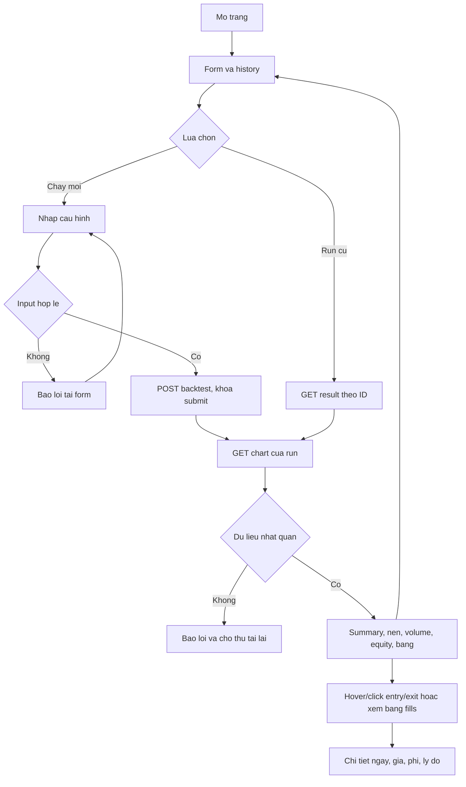
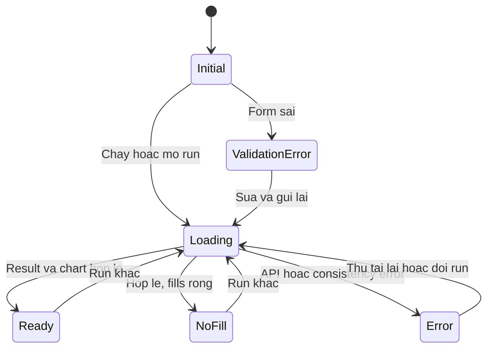
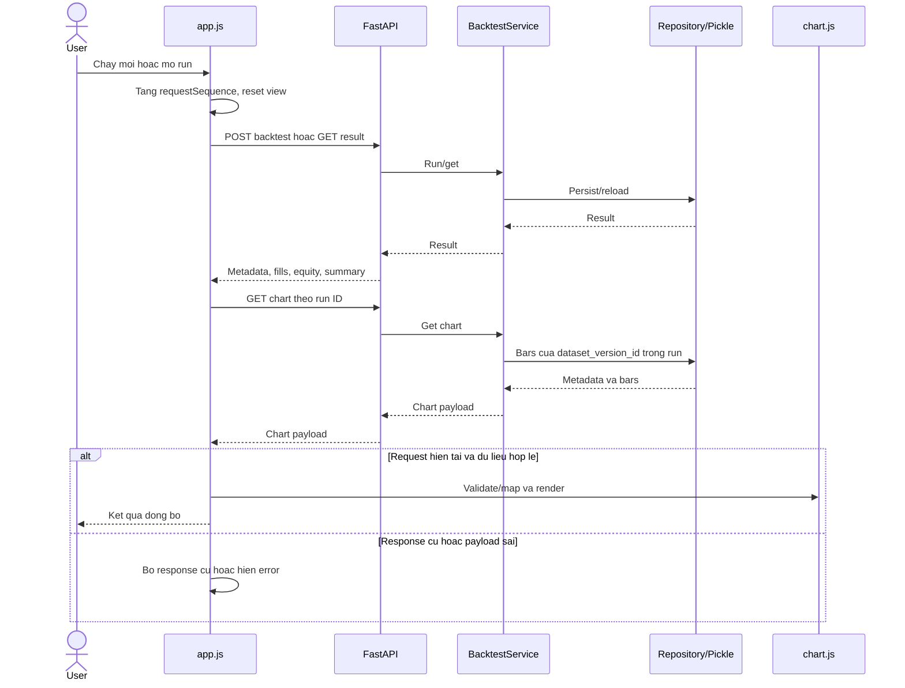

# Kế hoạch UI chart VN30F1M và executed fills

> **Storage 18/09/2026:** [Parquet + JSON](technical-plan.md#6-persistence-parquet-json) thay target pickle trong kế hoạch bên dưới. Raw nguồn giữ nguyên; SQLite/PostgreSQL cho metadata/session agent còn chờ chốt. Nội dung implementation/mốc cũ giữ để truy vết; chưa migrate code hoặc nghiệm thu storage mới.

**Bàn giao 17/09:** đã implement lát cắt chart snapshot VN30F1M thật, gồm nến,
volume, crosshair, lọc ngày và bảng; chạy riêng không cần DB. Chưa hoàn tất chart
theo run/executed fills/equity hoặc pickle. Bằng chứng và trạng thái C1–C3 ở
[PROGRESS](progress.md), cách chạy ở [README](../README.md).

Cập nhật: 15/09/2026. Thiết kế để triển khai; trạng thái và bằng chứng được quản lý
tại [PROGRESS](progress.md).

Điều chỉnh storage 15/09: target của plan chuyển sang pickle local; code hiện tại
vẫn là PostgreSQL cho tới bước implementation sau khi tài liệu source-of-truth được
đồng bộ.

Điều chỉnh scope 16/09: dữ liệu chart đổi sang VN30F1M 5 phút; strategy chưa chốt.

## Outline

1. Mục tiêu, chức năng và phần Phase 3 làm sớm.
2. Dependency và ranh giới dữ liệu.
3. Thiết kế: API, stack, user flow, layout, state/sequence diagram, cây file.
4. Thứ tự công việc và estimate; state từng bước nằm trong PROGRESS.
5. Test cases và cách thực hiện; các case synthetic không cần user confirm.
6. Nội dung chờ xác nhận: CFM-01 snapshot/kỳ báo cáo và expected result nghiệm thu.

## 1. Mục tiêu và phạm vi

Yêu cầu tối thiểu: người xem biết từng executed fill (lần khớp)
đã xảy ra ở bar nào và giá nào trên chart nến. Quy tắc presentation và acceptance do
[Web UI Specification](../design/web-ui-specification.md) sở hữu; dữ liệu theo
[Data Contract](../data/vn30f1m/data-contract.md), lịch theo [Backtest Plan](backtest-plan-v0.md).

- Bắt buộc: nến 5 phút VN30F1M, marker entry/exit, hover/click xem chi tiết, zoom/scroll,
  fit view, responsive, volume histogram, equity line và các bảng sẵn có.
- Để baseline Phase 3: indicator overlays/panels, trade return chưa có contract
  và tương tác nhiều chart nâng cao. Không thêm rule/indicator vào engine.

### Chức năng và dữ liệu

| ID    | Chức năng          | Hành vi                                                                                                          |
| ----- | -------------------- | ----------------------------------------------------------------------------------------------------------------- |
| UI-01 | Form/chạy backtest  | Dataset/version, ngày, vốn, phí/slippage; validation; khóa submit khi POST đang chạy                        |
| UI-02 | History/mở lại run | Chọn run đã lưu; tải đúng result và chart sau restart                                                     |
| UI-03 | Nến VN30F1M         | OHLC 5 phút của run; timezone UTC+7, crosshair, zoom/scroll, fit view, resize                                   |
| UI-04 | Entry/exit           | Một marker mỗi fill; side/action + hình + màu; tooltip/click detail đúng timestamp/giá/quantity/fee/reason |
| UI-05 | Volume               | Histogram từ bars.volume, chung trục ngày với nến                                                            |
| UI-06 | Equity               | Line riêng từ equity_history; giữ bảng để đối chiếu                                                      |
| UI-07 | Summary/bảng        | Giữ fills/trades/open position/audit; thêm entry_price, exit_price, fees có sẵn vào bảng trades             |
| UI-08 | State/lỗi           | Loading, no-fill, open-position, input/API/consistency error; thử tải lại; không ghép hai run                |
| UI-09 | Khả năng sử dụng | Responsive, keyboard/focus/label, aria-live; side/action không chỉ phân biệt bằng màu                       |

### Phần baseline có thể làm thêm nhanh

| Phần                                         | Quyết định         | Cơ sở / effort tăng sơ bộ                                                  |
| --------------------------------------------- | --------------------- | ------------------------------------------------------------------------------- |
| P3.1 volume                                   | Thêm vào bắt buộc | OHLCV đã có volume; thêm histogram khoảng 1–2h                            |
| P3.3 cột trade đã có                      | Thêm vào bắt buộc | Backend đã trả giá vào/ra, quantity, fees, net_pnl; khoảng 0,5h           |
| P3.4 equity line                              | Thêm vào bắt buộc | equity_history đã có; thêm line series khoảng 1–2h                        |
| P3.2 indicators                               | Để sau              | Thiếu indicator-series contract và mapping backend; cần test riêng          |
| Trade return và tương tác chart nâng cao | Để sau              | Chưa có field/quy ước return từng trade; chưa cần để xem vị trí fill |

Effort tăng đã gộp trong mục 4, không cộng lần nữa. P3.3/P3.4 chỉ hoàn thành toàn
bộ khi toàn bộ phần tương ứng của WBS đã được nghiệm thu.

## 2. Hiện trạng và dependency

- `web/index.html` có form, summary, fills, trades, audit và lịch sử run.
- API run/list/detail và PostgreSQL `market_bars` hiện có; target là repository đọc
  dataset snapshot và run từ pickle local, response hiện chưa có OHLCV.
- `fills` đã có ID, order ID, signal/fill time, price, side, quantity và fee.
- Notebook preprocessing và manifest được mở Git tracking ngày 15/09; raw vẫn
  local. Notebook đang chọn raw 2024–2026, manifest mô tả 2019–2023. Giữ nguyên
  hai file khi lập plan; không tự đổi dataset hoặc sửa hash để bỏ qua validation.
- Source Docker/notebook có trong worktree; trạng thái acceptance theo PROGRESS.
  Lựa chọn dataset nghiệm thu cần CFM-01; phần quyết định trong mục 6 để trống.
- Có thể phát triển API/chart với fixture offline trước; nghiệm thu snapshot thật
  cần giải quyết dependency dữ liệu. Fixture 5 dòng hiện có không đủ warm-up
  strategy; dùng fixture executed-fill synthetic, không gán nó thành strategy requirement.

## 3. Thiết kế triển khai tối thiểu

### 3.1. API và dữ liệu chart dự kiến

Thêm `GET /api/backtests/{run_id}/chart`, đi qua route -> application -> repository.
Không sửa engine để phục vụ chart và không nhét OHLCV vào endpoint list history.

- Chỉ đọc run `succeeded`; run không có/không thành công trả 404, UUID sai trả 422.
- Lấy VN30F1M bars từ dataset snapshot cùng version/hash đã lưu trong pickle của
  run, giới hạn datetime của run và tăng nghiêm ngặt theo timestamp.
- Response gồm `metadata` (run ID, dataset ID/version/hash, symbol, timeframe,
  datetime range, timezone, price unit và label) và `bars` (timestamp, OHLCV).
- Giá dùng precision/serialization hiện có; frontend chỉ đổi thành số để vẽ.
  Không tự nhân 1.000 hoặc gán đơn vị VND khi metadata còn unknown.
- UI lấy fills từ result hiện có, kiểm tra run/version/hash giữa hai response
  trước khi vẽ. Metadata và bars phải đến từ cùng dataset của run.
- Bars rỗng, trùng ngày, sai OHLC hoặc fill không có bar: lỗi consistency, không
  tự sửa dữ liệu. Contract dự kiến: chart endpoint trả 409 với
  `detail={code: CHART_DATA_INCONSISTENT, message, issues: [...]}`; mỗi issue có
  code/field/date phù hợp. Không có run/không succeeded trả 404 với
  `detail.code=RUN_NOT_FOUND`; UUID sai giữ 422 của FastAPI; lỗi storage trả 500 với
  thông báo chung không lộ path/stack trace. C1 ghi vào Data Contract
  trước implement; không đổi error contract các endpoint cũ trong task này.
- Dùng dataset đã persist để reload chart sau restart; không fetch live nguồn khác.

### 3.2. Stack frontend và cách chạy

| Thành phần   | Lựa chọn triển khai                                          | Cách dùng                                                                    |
| -------------- | --------------------------------------------------------------- | ------------------------------------------------------------------------------ |
| Frontend       | HTML5 + CSS thuần + JavaScript ES modules                      | Một trang; tách markup, style, controller và chart; tái dùng UI hiện có |
| Chart library  | TradingView Lightweight Charts v5, standalone ESM               | Candlestick, price-position marker, histogram volume và line equity           |
| HTTP           | fetch + AbortController native                                  | Cùng origin; request sequence ID loại response cũ; không tự retry POST    |
| State          | Biến module trong app.js                                       | phase, activeRunId, requestSequence, result, chartPayload, selectedFillId      |
| Static server  | FastAPI StaticFiles tại /static; GET / trả index.html         | Resolve đường dẫn theo package; phục vụ cùng backend process            |
| CSS/format     | Grid/Flex, native input, font hệ thống, Intl.NumberFormat     | Breakpoint 768px; giá theo metadata; chỉ format % cho return có sẵn        |
| Package/Docker | Vendor asset pin version và checksum, đi cùng Python package | Không tải chart library qua CDN khi người dùng mở web                    |
| Tests          | unittest/TestClient; Node 22 node:test; browser checks          | Python deps/Node đã có; Node chỉ dùng khi test JS                         |

Không thêm React/Vue hoặc bundler. Library đã được chọn trong plan; chọn patch
release cụ thể là việc kỹ thuật ở C1, không cần user confirm. Docs hiện có
`SeriesMarkerPrice.price`; phải kiểm tra feature trên đúng asset được pin,
không mặc định mọi bản v5 đều có API giống docs mới nhất. Ghi version/URL/checksum
trong vendor/README.md, kèm LICENSE/NOTICE và attribution theo bản phân phối.

Marker ánh xạ `id=fill_id`, thời điểm=`fill_time`, giá=`fill_price`; entry/exit và side khác chữ,
hình dạng và màu. Price scale phải bao phủ giá fill có slippage. Tooltip reason
join theo IDs qua orders/signals. Bảng fills tiếp tục cho phép đối chiếu và truy
cập bằng bàn phím. Không tự tính lại P/L hoặc tạo fill từ signal.

Nguồn kỹ thuật đã tham khảo:
[marker theo giá](https://tradingview.github.io/lightweight-charts/docs/api/interfaces/SeriesMarkerPrice),
[license](https://github.com/tradingview/lightweight-charts/blob/master/LICENSE),
[attribution](https://github.com/tradingview/lightweight-charts#attribution-requirements),
[volume histogram](https://tradingview.github.io/lightweight-charts/tutorials/how_to/price-and-volume),
[FastAPI static files](https://fastapi.tiangolo.com/tutorial/static-files/),
[Node test runner](https://nodejs.org/api/test.html).

### 3.3. User flow



Nếu POST thành công nhưng chart GET lỗi, nút Thử lại chỉ GET result/chart của run
đó, không tạo run mới. History tải lỗi hiển thị riêng và không biến một result đã
tải thành lỗi backtest. Hủy HTTP request không có nghĩa backend đã hủy backtest.

### 3.4. Layout tối thiểu

```text
VN30F1M Backtest                       [Run da luu]
[Dataset/version] [Tu/den ngay] [Von] [Phi/slippage] [Chay]
[Thong bao / thu lai] [Run ID + label + metadata chi tiet]
[Summary cards: cash/equity/realized/unrealized/return]
[Chu giai side/action cua fill]              [Fit view]
| Nen 5m + entry/exit          | Chi tiet fill da chon |
| Volume - cung ngay voi nen   |                      |
| Equity line - chart rieng                           |
[Fills] [Closed trades] [Open position] [Audit] [Equity table]
[Attribution]
```

Các bảng là section hiện có, không thêm tab framework. Mobile: form/cards xuống
dòng, detail dưới chart, bảng cuộn ngang trong section, chart theo chiều rộng
container. Equity có trục giá riêng, fit khi đổi run; chưa đồng bộ zoom/crosshair
giữa chart giá và equity. Giữ bảng fills làm đường truy cập bằng bàn phím.

### 3.5. UI state diagram



Open position là dữ liệu trong Ready, không phải request state riêng. Loading
hide/xóa result, tooltip và chart của run cũ; chỉ hiển thị toàn bộ khi kiểm tra
xong metadata và payload. NoFill vẫn có nến/volume/equity và giải thích bảng rỗng.

### 3.6. Sequence và ranh giới frontend/backend



### 3.7. Cây frontend và các file liên quan khi build

Cây dự kiến, không có nghĩa các file mới đã được implement:

```text
src/backtest_hpg/
├── web/
│   ├── index.html                   # markup, form, chart containers, tables
│   ├── styles.css                   # layout, responsive, focus, tooltip, state
│   ├── app.js                       # fetch, form/history, state, table rendering
│   ├── chart.js                     # validation/mapping và chart lifecycle
│   ├── package.json                 # private + type:module cho Node test
│   └── vendor/
│       ├── lightweight-charts.standalone.production.mjs
│       ├── LICENSE
│       ├── NOTICE
│       └── README.md                # version, source URL, checksum, bundled notices
├── api/app.py                       # mount /static, giữ GET /
├── api/backtest_routes.py           # thêm GET /{run_id}/chart
├── application/ports.py             # get_chart trong port hiện có
├── application/run_backtest.py      # use case get_chart
└── infrastructure/pickle_store.py  # load chart qua run/dataset version
tests/
├── fixtures/chart-ui.json           # synthetic result + bars, quan hệ IDs rõ
├── web/chart.test.mjs               # node:test cho mapper/validation thật
├── test_application_api.py          # mở rộng MemoryRepository hiện có
└── test_chart_api.py                # chart endpoint/errors/static assets
```

- index.html tải styles.css và app.js; app.js import chart.js; chart.js import
  standalone asset đã pin. Tạo DOM/chart trong hàm, không ở lúc import, để Node
  test dùng cùng mapper mà không cần giả browser.
- chart.js sở hữu instances và ResizeObserver; dispose trước khi thay instance
  để không tăng canvas/listeners sau nhiều lần mở run.
- web/package.json chỉ có metadata module/private; không cần npm install để chạy
  app, không có npm build pipeline. pyproject.toml bổ sung CSS/JS/vendor vào
  package-data; kiểm tra asset sau install và trong image Docker cuối.
- Không tạo api.js/store.js/components khi app.js/chart.js còn đủ gọn. Evidence
  tạm nằm .agents; source và test deliverable nằm theo cây trên.

## 4. Thứ tự công việc và estimate

Estimate mới: **20–28h (2,5–3,5 ngày công)**, thay 16–24h; đã gồm volume, equity,
cột trade có sẵn và kiểm tra. Chưa gồm xử lý provenance/lỗi hạ tầng có sẵn.
Ngày bắt đầu/kết thúc chưa cam kết. State/bằng chứng từng bước ở [PROGRESS](progress.md).

| Bước | WBS                    | Việc và file dự kiến                                                                        | Effort              | Phụ thuộc                                        |
| ------ | ---------------------- | ----------------------------------------------------------------------------------------------- | ------------------- | -------------------------------------------------- |
| C1     | P3.1                   | Contract/error, chart query; pin asset/license; static route/package; fixture/API checks        | 4–6h               | Có thể dùng fixture offline, không cần CFM-01 |
| C2     | P3.1 + phần P3.3/P3.4 | Tách HTML/CSS/JS; nến, marker/tooltip, volume, equity, cột trade; state và mapper tests     | 10–14h             | C1                                                 |
| C3     | P1.7 + phần P3.4      | Browser, assets trong image, pickle/restart reload, notebook, regression, README                | 6–8h               | C2; phần dữ liệu thật cần CFM-01              |
| R1     | Release                | Review diff/secret/output/ignore; commit và push chung theo yêu cầu sau khi đạt acceptance | Tính sau kiểm tra | C3 và Docker/notebook được xác minh           |

P3.1 chỉ tính hoàn thành khi cả nến và volume được nghiệm thu;
P3.3 chỉ tính hoàn thành toàn bộ khi phần bảng trade/P&L theo WBS cũng được nghiệm
thu. Phần làm sớm được ghi bằng note, không cộng trùng effort/progress.

## 5. Kiểm tra phải thực hiện khi build

### 5.1. Cách kiểm tra

- Python: unittest + TestClient/MemoryRepository có sẵn; fixture offline cho API.
  Pickle save/atomic replace/restart reload phải được đối chiếu trong acceptance.
- JavaScript: Node 22 có sẵn, node:test + node:assert/strict import cùng mapper
  chart.js. Fixture chart-ui.json dùng chung; copy fixture rồi tạo biến thể lỗi.
- Browser thật: ghi actual/pass/fail và ảnh cho case canvas/tương tác; kiểm tra
  DOM/mapper không thay thế việc nhìn thấy marker đúng trên chart.
- TC-01–24 dưới đây đã đủ thông tin để plan/implement bằng synthetic data,
  không cần user confirm. Expected snapshot thật ở mục 6 chờ CFM-01.
- Chưa thêm Jest/Vitest/Playwright; test framework mới chỉ xem xét nếu cách kiểm
  tra trên không tái lập được lỗi thực tế cần xử lý.

Lệnh dự kiến sau khi source/test được implement:

```powershell
.venv\Scripts\python.exe -m unittest discover -s tests -p "test_*.py" -v
node --test tests/web/chart.test.mjs
docker compose up --build
docker compose restart app
```

### 5.2. Test cases

| ID / chức năng   | Input và thao tác                                                      | Expected result                                                                                      | Cấp kiểm tra       |
| ------------------ | ------------------------------------------------------------------------ | ---------------------------------------------------------------------------------------------------- | -------------------- |
| TC-01 / UI-01      | Ngày bắt đầu sau kết thúc, vốn <=0 hoặc field thiếu             | Lỗi form, không gửi input sai; bypass client vẫn bị backend từ chối                           | Browser + API        |
| TC-02 / UI-01      | Double-click Chạy khi POST chưa xong                                   | Chỉ một POST; submit khóa; mở lại sau kết thúc/lỗi                                           | Browser              |
| TC-03 / UI-02      | Tạo run hoặc mở run cũ                                               | Cùng run/version/hash; OHLCV đúng dataset và khoảng ngày inclusive                             | API + Browser        |
| TC-04 / UI-03      | Bar O=100,H=105,L=98,C=103, ngày cố định                             | Thân/râu/crosshair đúng số, không đổi ngày theo timezone                                    | JS + Browser         |
| TC-05 / UI-04      | BUY 2026-01-05 giá 101, SELL 2026-01-07 giá 110, có bars tương ứng | Đúng hai marker với fill IDs, ngày/giá/side; tooltip khớp bảng                                | JS + Browser         |
| TC-06 / UI-04      | Signal thứ Sáu 02/01/2026, fill thứ Hai 05/01                         | Marker tại 05/01, không ở ngày signal/cuối tuần                                                | JS + Browser         |
| TC-07 / UI-04      | Fill price=106, bar high=105 do slippage giả lập                       | Marker ở 106, thấy được; không ép về high                                                    | JS + Browser         |
| TC-08 / UI-04      | Hai order IDs có reason khác nhau; đổi thứ tự arrays               | Join đúng IDs, không join reason bằng chỉ số/ngày                                             | JS                   |
| TC-09 / UI-08      | fills rỗng, orders pending/rejected, equity_history hợp lệ            | Không marker; vẫn nến/volume/equity và giải thích chưa có fill                               | JS + Browser         |
| TC-10 / UI-07      | Chỉ BUY đã khớp, open_position cuối kỳ                             | Một BUY, không tạo SELL; unrealized tách realized                                                | JS + Browser         |
| TC-11 / UI-08      | Thiếu bar của fill, trùng/đảo ngày, sai OHLC, null/NaN/Infinity    | Reject payload, lỗi consistency; không sort/fill/dời marker                                       | JS + API             |
| TC-12 / UI-08      | Lệch lần lượt run_id, dataset_id/version, hash                       | Không render dữ liệu trộn; báo lỗi                                                             | JS + Browser         |
| TC-13 / UI-02      | Chọn A rồi B; response A đến sau B                                   | Chỉ B được hiển thị; tooltip/listeners của A được dọn                                     | Browser              |
| TC-14 / UI-08      | POST thành công, chart GET lỗi; thử lại; history GET lỗi riêng    | Chỉ GET lại run/chart, không POST mới; history lỗi không hủy result đã tải                 | Browser              |
| TC-15 / UI-05      | Volume 0 và 1.000 ở hai ngày của bars                                | Giá trị đúng 0/1000, không mất ngày, chung time scale với nến                               | JS + Browser         |
| TC-16 / UI-06      | Equity 1000,1100,900 ở ba phiên; summary cuối=900                     | Line đúng ba điểm, cuối khớp summary; không tự tính equity                                  | JS + Browser         |
| TC-17 / UI-07      | Trade có giá vào/ra, quantity, fees, net_pnl; summary return=0.1      | Cột đúng payload, return format 10%; không tự tính trade return                                | Browser              |
| TC-18 / UI-03,09   | Zoom/scroll/fit; resize 1280px rồi 390px; mở run nhiều lần           | Marker đúng tọa độ, volume không che nến, không tràn trang/nhân canvas/listeners           | Browser              |
| TC-19 / UI-09      | Bàn phím, click marker trên mobile, không dựa vào màu             | Form/bảng có focus/label; detail đọc được; aria-live báo state                               | Browser              |
| TC-20 / UI-08      | Reason/API message chứa HTML có event handler                          | Hiển thị như text, không thực thi HTML/script                                                   | Browser              |
| TC-21 / UI-02,03   | GET /, CSS, JS, vendor sau build/install image; chặn CDN                | Assets đúng MIME, chart tải được, attribution hiện trên trang                                | API + Docker/Browser |
| TC-22 / API        | UUID sai, run không có, run failed, bars mất, pickle lỗi/sai version | Lần lượt 422/404/404/409/500; không lộ path hoặc stack trace                                   | API                  |
| TC-23 / UI-02      | Restart backend/containers giữ volume, mở cùng run                    | Chart/fills/summary/equity/notebook nhất quán; không chạy lại strategy để xem                 | Pickle + Browser     |
| TC-24 / regression | Cùng input/config; chạy tests cũ và so business result               | Accounting/strategy/timing/causality không đổi; fixture UI không giả làm dữ liệu nghiệm thu | Python + integration |

Test status/actual ở PROGRESS hoặc evidence được liên kết từ đó. Expected trong
plan không phải test đã pass; kiểm tra ignore không phải preprocessing acceptance.

## 6. Nội dung chờ xác nhận

Heading dưới cố ý để trống; CFM-01 là một quyết định chung cho cả hai mục.
Chi tiết cần xác nhận ở checklist local được ghi trong PROGRESS. Phần frontend
và test synthetic phía trên có thể triển khai độc lập.

### 6.1. CFM-01 — Snapshot, version và kỳ báo cáo dùng nghiệm thu

### 6.2. CFM-01 — Expected result và các fill mẫu trên snapshot đã chọn
