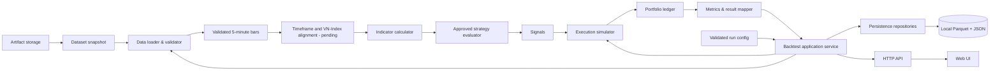

# Kế hoạch kỹ thuật backtest VN30F1M

Cập nhật quyết định scope: 18/09/2026.

Ưu tiên: source → API → `notebooks/backtest-results.ipynb` chạy backtest
VN30F1M 5 phút, chưa cần agent. Đầu việc, dependency, field user xác nhận và
acceptance tại [checklist local hiện hành](../../.agents/checklists/vn30f1m-backtest-checklist.md).

**State hiện hành sau triển khai:** Open/Close/available_at và rollover giữ vị
thế đã được user chốt, runtime policy tĩnh đã có. Intraday engine/repository/API
và notebook implement, tests dùng fixture synthetic. Hai JSON mới đã import
raw + lossless Parquet; source chưa đủ report 15/03–15/09 vì thiếu 16–17/03
và warm-up. User giữ range và chọn bổ sung lịch sử. Không tick real acceptance.
Xem [runbook](vn30f1m-backtest-runbook.md). Các dependency chưa chốt trong ghi
chú capture cũ bên dưới là lịch sử trước các xác nhận bổ sung.

## Đợt triển khai theo checklist đã điền — 18/09

Plan này được cập nhật trước thay đổi source.

### Tiếp tục sau khi user cung cấp JSON và cập nhật C04/C06

User bổ sung map trong `docs/data/vn30f1m/vn30f1m-rollover-map.md` và xác nhận
cho phép lịch/mã tham khảo như assumption mô phỏng, **giữ vị thế qua đáo hạn**.
Forced-close trong bản map trước bị thay bằng quyết định này; không thêm exit rule.
Policy runtime lưu map theo tháng tham khảo, rollover_action=hold và pin hash.
User xác nhận tiếp theo: **giữ kỳ báo cáo 15/03–15/09 và bổ sung lịch sử 5 phút**,
không đổi sang 18/03 hoặc 25/03 để làm run pass. Cần bổ sung cả VN30F1M và
VNINDEX: target 01/03–17/03/2026 (gồm hết phiên 17/03), tối thiểu 200 market
samples và 65 futures samples đã available trước phiên đánh giá đầu tiên,
đồng thời phải đủ expected sessions 16–17/03. Snapshot mới sẽ có provenance/version
riêng; chưa ghép daily, nguồn khác hoặc tự dùng ngày thiếu làm holiday.
Lịch nghỉ trong report range đối chiếu thông báo HNX, không suy ra holiday từ
missing rows: [lịch năm 2026](https://www.gov.hnx.vn/vi-vn/chi-tiet-lich-nghi-gd-60021971.html?_page=1),
[Giỗ Tổ/30-4/1-5](https://web02.hnx.vn/vi-vn/chi-tiet-lich-nghi-gd-60022583.html?_page=1),
[Quốc khánh](https://hnx.vn/vi-vn/chi-tiet-lich-nghi-gd-60023268.html?_page=1).
Không lấy thêm giá từ nguồn ngoài hai JSON user cung cấp. Session labels giữ
tập source contract đã quan sát: futures 49 required; market 48 labels chung
required, 6 labels biến thiên optional, không bỏ optional bars khỏi indicator.
Kỳ báo cáo 15/03 hiện fail coverage vì thiếu 16–17/03; cần user chốt range
khác hoặc bổ sung lịch sử. Không tự đổi ngày đầu kỳ để làm run pass.

- Import offline hai JSON mới trong `data/`; không gọi lại endpoint. Giữ nguyên
  bytes file user và snapshot chart cũ. Extraction time nguồn chưa có evidence
  thì null, thời gian import ghi riêng; không dùng mtime làm extraction time.
- Payload VN30F1M thực tế có 6.076 nến, VNINDEX 6.227 nến; cả hai bắt đầu
  18/03/2026, không có warm-up trước kỳ báo cáo đã chốt **15/03–15/09/2026**.
  Tên file/query range không chứng minh coverage. Thiếu lịch sử phải hiển thị
  UNEVALUABLE; missing expected session phải fail theo C05.
- C04 chốt assumption mô phỏng: timestamp đầu bar, Close/available_at bằng
  Open + 5 phút, record 14:45 là ATC, giá VN30F1M là index points. Giữ record
  14:45 theo cùng timing mô phỏng; không diễn giải thành nguồn đã xác minh.
  Pending được fill Open của bar kế tiếp, kể cả ATC theo mô hình normalized;
  đây không mô phỏng auction order/liquidity.
- VNINDEX có timestamp khác VN30F1M: tính SMA200 trên chính chuỗi market,
  lấy market bar completed gần nhất tại decision bằng available_at; không
  inner-join làm mất futures bars, không lặp market Close để tạo 200 mẫu giả.
- Implement datetime vào shared engine/models, giữ compatibility daily HPG.
  Signal/equity ghi Close time, fill ghi Open time; start/end date lọc theo
  ngày local của Open; warm-up không giao dịch. Ghi coverage/status/reason rõ.
- Implement repository local theo port hiện có: Parquet giữ timestamp + giá
  Decimal dạng chuỗi để round-trip không đổi; JSON complete result publish atomic.
  Pin bundle + policy hashes vào run. Thêm composition root intraday riêng để
  không xóa/migrate database HPG hiện có. Không agent/background job.
  Parquet cần optional dependency `pyarrow==25.0.0`; Python 3.13 được hỗ trợ,
  Apache Arrow dùng license Apache-2.0; kiểm tra nguồn chính thức trước tích hợp:
  [PyPI](https://pypi.org/project/pyarrow/25.0.0/),
  [installation](https://arrow.apache.org/docs/python/install.html),
  [license](https://github.com/apache/arrow/blob/main/LICENSE.txt).
- C05 vẫn chưa có static rollover map/lịch session. Repository/API phải báo
  thiếu input đó, không tạo map từ giá hoặc đoán lịch. Policy JSON có timezone,
  trading_dates, required/optional Open labels theo symbol và roll ranges.
  Kiểm tra thiếu bar trong phiên, session thiếu trọn ngày và rollover coverage
  trước core; không mở đường bỏ qua validation để demo.
- Test fixture intraday có policy tổng hợp được ghi rõ là synthetic, để nghiệm
  thu logic/HTTP/save-reload/restart. Nghiệm thu snapshot thật và toàn notebook
  giữ Blocked cho tới khi đủ policy/coverage; notebook dùng payload VN30F1M
  bundle thật và hiển thị lỗi validation thật khi input còn thiếu.

Thứ tự: cập nhật plan/contract → import raw → shared datetime/market alignment →
repository/API → notebook → test → tick checklist theo actual evidence. Các mục
dependency cũ bên dưới giữ lịch sử; C04 và report range nay đã được user chốt.

- C01–C03 đã chốt: VN-Index SMA200 theo 200 nến 5 phút (gồm nến market
  đã available tại decision); nền giá 65 và volume trung bình 50 nến trước t,
  không gồm t. Không fallback daily; cửa sổ liên tục qua phiên.
- C06 cho phép lấy hai URL VNDIRECT resolution 5, query Unix
  `1772323200..1789516800`, symbol VN30F1M và VNINDEX. Tải offline một lần,
  giữ bytes/hash/extraction time và manifest mới, không đổi snapshot chart cũ.
- Triển khai trước phần capture/provenance và validator schema đã có; kiểm tra
  payload thực tế, số nến warm-up và độ phủ. Không coi schema pass là session pass.
- C04 chưa định nghĩa timestamp đầu/cuối bar, available_at và record 14:45.
  URL tĩnh không thay các semantics này. Không tự chọn assumption để chạy engine.
- C05 đã chốt giữ vị thế/pending qua nghỉ và fail khi missing bar hoặc thiếu
  rollover map. Cần input rollover map và lịch/session tĩnh; hiện chưa có.
- Kỳ báo cáo 16/03–15/09 là đề xuất trước đó; C06 hiện chỉ có URL, cần ghi
  rõ kỳ báo cáo được duyệt trước khi nghiệm thu runtime.
- Sau khi đủ các input trên: datetime models/alignment → core + regression,
  Parquet + JSON repository → API → chạy notebook. Kiểm tra version/license
  Parquet trước khi thêm dependency; chưa cần cài thư viện trong bước capture.

Acceptance bước capture: mỗi URL trả payload hợp lệ hoặc fail rõ; manifest pin
hash/version/count/range/timezone/source/extraction của cả hai snapshot; đọc lại
kiểm tra integrity; không sửa raw cũ hoặc công bố run thành công. Test bằng stdlib
unittest cho file hỏng, partial download và đọc lại. API/backtest/notebook chỉ tick
khi đã chạy thực tế với đầy đủ session/rollover/time semantics.

Điều chỉnh thứ tự 15/09: nến P3.1 và fill marker P3.3 được kéo lên trước Phase 2
cho đợt push Docker/notebook/chart. Các mục ghi Phase 3 bên dưới là baseline;
thứ tự triển khai mới và phương án reuse UI/API hiện có nằm trong
[kế hoạch chart](candlestick-ui-plan.md). Chart implementation chưa bắt đầu.

Quyết định scope 17/09: VN30F1M thay dữ liệu HPG; giữ rule CANSLIM, VN-Index cho
R1 và mô hình tiền normalized như baseline theo
[CANSLIM Rule](../strategies/canslim-rules.md). Nguồn, strategy và execution chính
là 5 phút; 1D chỉ hỗ trợ. Window units, volume mapping, session và market/warm-up
snapshot: C01–C03 đã chốt, C04 còn thiếu semantics, C05 thiếu map/lịch và C06
chưa tải thành công. Đây là cập nhật tài liệu,
chưa phải implementation hoặc acceptance backtest VN30F1M.

Quyết định storage 18/09: Parquet cho dataset đã validate; JSON cho manifest, config
và complete result nhỏ, thay kế hoạch pickle 15/09. Raw nguồn giữ nguyên.
SQLite/PostgreSQL cho session và trạng thái agent còn chờ chốt. Đây là cập nhật
tài liệu; source và Docker chưa migrate khỏi PostgreSQL.

Tài liệu này ghi các quyết định triển khai và thứ tự xây hệ thống. Requirement chi
tiết nằm trong [SRS](../requirements/software-requirements-specification.md), còn cấu trúc module và
luồng runtime nằm trong [System Design](../design/system-design.md).

## 1. Mục tiêu hiện tại

- Phase 1 tái sử dụng CANSLIM evaluator và accounting normalized hiện có cho
  VN30F1M 5 phút sau khi chốt indicator/data mapping.
- Không dùng `backtesting.py` làm dependency hoặc source of truth của production
  core. Nó có thể sẽ được áp dụng trong một hệ thống khác để so sánh cách vận hành với kết quả hiện tại.
- API chỉ gọi application
  service; không chứa indicator, strategy hay accounting logic.
- Có Web UI để chạy và xem backtest. Bước UI đầu tiên hiển thị
  P/L, equity, fills và lịch sử giao dịch; chart nến được triển khai ở Phase 3.
- Parquet + JSON lưu snapshot và lịch sử backtest cho demo local single-process.
- Core vẫn chạy deterministic và không import persistence code. Application service
  lưu `BacktestResult` qua repository interface sau khi core hoàn tất.

## 2. Bộ tài liệu kỹ thuật

| Tài liệu                                       | Câu hỏi được trả lời                                            |
| ------------------------------------------------ | ---------------------------------------------------------------------- |
| [SRS](../requirements/software-requirements-specification.md)     | Hệ thống phải làm gì và điều kiện nghiệm thu là gì?        |
| [CANSLIM Rule](../strategies/canslim-rules.md)                   | Baseline hiện có là gì và phần nào chưa áp dụng được?            |
| [System Design](../design/system-design.md)                 | Các module, dependency, state transition và runtime flow là gì?    |
| [VN30F1M Data Contract](../data/vn30f1m/data-contract.md) | Input/output 5 phút, session, validation và provenance ra sao?   |
| [Kế hoạch Parquet + JSON](#6-persistence-parquet-json)    | MVP lưu/reload dataset và run local thế nào?                       |
| [Web UI Specification](../design/web-ui-specification.md)   | UI tối thiểu và ranh giới chart Phase 3 là gì?                   |
| [Accounting Test Cases](../testing/hpg/accounting-test-cases.md) | Cash, fee, P/L và equity kỳ vọng bằng số cụ thể là bao nhiêu? |
| [Backtest Plan v0](backtest-plan-v0.md)           | Phase, lịch và output quản lý công việc là gì?                 |

## 3. Kiến trúc tổng thể



Luồng xử lý chi tiết, state machine và interface nằm tại
[system-design.md](../design/system-design.md).

## 4. Thành phần cần triển khai

| Thành phần           | Trách nhiệm                                                         | Không được làm                                 |
| ---------------------- | --------------------------------------------------------------------- | --------------------------------------------------- |
| Data loader/validator  | Đọc snapshot, chuẩn hóa field, kiểm tra schema và chronology    | Tự điền dữ liệu thiếu hoặc tìm nguồn khác |
| Indicator calculator   | Chỉ tính indicator của strategy đã duyệt                           | Dùng bar tương lai hoặc coi thiếu dữ liệu là pass |
| Strategy evaluator     | Áp dụng đúng strategy version đã duyệt, tạo signal và reason       | Tạo fill hoặc sửa portfolio                      |
| Execution simulator    | Thực thi timing/slippage/cost theo specification đã duyệt          | Khớp tại Close đã tạo signal                     |
| Portfolio ledger       | Cash, position, fees, realized/unrealized P/L, equity                 | Sửa lịch sử sau khi đã ghi                     |
| Result mapper          | Signals, orders/fills, trades, equity history và summary             | Suy diễn giao dịch từ signal                     |
| Application service    | Điều phối một run và trả lỗi có cấu trúc                    | Chứa rule nghiệp vụ                              |
| Persistence repository | Lưu/reload snapshot Parquet và result JSON theo version/run ID | Công bố partial run hoặc đưa I/O vào domain core |
| Artifact storage       | Lưu raw snapshot/export lớn theo content hash                       | Làm system of record cho query history             |
| API adapter            | Validate request, gọi application service, serialize response        | Gọi trực tiếp từng module domain                |
| Web UI                 | Hiển thị summary, equity, fills và trade history từ API           | Tự tính signal, fill hoặc P/L khác backend      |

## 5. Event order — 5 phút, session/mapping còn chờ chốt

Với mỗi bar đánh giá 5 phút hợp lệ `t`, engine xử lý theo thứ tự. Tập bar,
Open/Close/available_at và support alignment còn chờ phần thiếu C04–C06:

1. Nhận bar `t` đã được data layer xác nhận hợp lệ.
2. Tại Open, xử lý pending order từ completed bar trước theo execution rule đã duyệt.
3. Sau Close, cập nhật indicator/state chỉ bằng dữ liệu đến hết `t`.
4. Đánh giá entry/exit theo strategy đã duyệt.
5. Signal hợp lệ tạo pending order cho bar kế tiếp, không tạo fill tại `t`.
6. Cách dùng record 14:45 và giữ vị thế qua phiên phải được data/strategy contract chốt.

Hệ quả:

- Nếu rule dùng Close `t`, lệnh sớm nhất chỉ có thể fill từ Open bar kế tiếp.
- Signal cuối dataset được ghi nhận nhưng không tự tạo fill.
- Thiếu expected next bar phải tạo trạng thái/lỗi kiểm tra được, không tự nhảy qua
  khoảng trống dữ liệu.

## 6. Persistence Parquet JSON

Quyết định 18/09/2026 thay kế hoạch pickle 15/09; chưa migrate hoặc nghiệm thu
runtime. Parquet là định dạng bảng, không thay chức năng transaction của database.

| Dữ liệu | Hướng lưu |
| --- | --- |
| Raw nguồn | Giữ nguyên file để đối chiếu provenance |
| OHLCV đã validate, snapshot VN30F1M/VN-Index | Parquet bất biến theo dataset version |
| Manifest | JSON: schema version, dataset ID/version, hash, nguồn, extraction time, số dòng, khoảng thời gian, raw/derived paths và hashes |
| Config, summary, complete result nhỏ | JSON theo run ID, giữ DTO và precision hiện có |
| Fills, trades, equity history lớn | Tách Parquet khi kích thước thực tế cần; chưa bắt buộc |
| Session, trạng thái run, tool-call audit của agent | SQLite hoặc PostgreSQL còn chờ chốt theo nhu cầu query/concurrency |

Demo local bắt đầu bằng Parquet + JSON; chưa cần database server mới. Agent đọc
qua tool/backend, không nạp toàn bộ bảng giá vào context LLM.

- Giữ raw và manifest hiện có; derived Parquet có provenance/hash riêng. Không sửa
  hash để che mismatch. Mỗi run pin đúng dataset version.
- Schema phải rõ timestamp/timezone và Decimal precision/scale; round-trip không
  đổi tiền hoặc timing. Đổi định dạng không phê duyệt aggregation, fill missing
  data hoặc mapping strategy VN30F1M.
- Ghi artifact vào đường dẫn mới, kiểm tra đầy đủ rồi publish manifest/result JSON
  cuối cùng bằng file tạm cùng thư mục và `os.replace`. Reader chỉ mở run đã publish,
  kiểm tra file/hash; thiếu/hỏng file hoặc schema không hỗ trợ phải fail rõ.
- Atomic replace một file không phải transaction nhiều file. Demo giới hạn một
  writer trong một process. Run ghi dở không được xuất hiện như thành công.
- Lưu run ID, dataset version/hash, config, strategy/engine version; khi có agent
  thêm model/prompt version và tool trace ở storage metadata được chọn.
- Docker target mount thư mục artifact để giữ dữ liệu sau restart; chưa xóa service
  PostgreSQL hoặc thay cấu hình runtime trong bước tài liệu này.
- Trước implementation kiểm tra dependency hiện có, version/license của thư viện
  Parquet được chọn; chưa cài dependency cho việc cập nhật kế hoạch.

Acceptance dự kiến: save/reload và restart giữ nguyên complete result; schema,
Decimal/timezone round-trip đúng; file thiếu/hỏng/hash sai hoặc ghi gián đoạn không
trả partial success; chart/result dùng cùng dataset version. Chưa chạy các tests này.

Tham khảo: [Apache Parquet overview](https://parquet.apache.org/docs/overview/).

## 7. Thứ tự triển khai Phase 1

1. Hoàn tất VN30F1M Data Contract và fixtures 5 phút/session.
2. Viết validator và test lỗi schema/chronology/OHLC.
3. Quét C01–C06: chốt window units, volume, session, alignment và VN-Index/warm-up.
4. Xác nhận data mapping với user/mentor trước khi nối nguồn VN30F1M vào evaluator.
5. Tái sử dụng indicator/evaluator CANSLIM và giữ regression cho rule đã chốt.
6. Nối event loop/pending order với accounting normalized cũ; không thêm futures accounting.
7. Thêm causality test: full dataset và dataset cắt tại `t` phải giống nhau đến `t`.
8. Tạo adapter Parquet + JSON và contract tests theo mục 6: save/reload, restart,
   schema/Decimal/timezone, file lỗi và publish bị gián đoạn.
9. Thêm application service: chỉ publish complete run bằng atomic replace sau khi
   core hoàn tất.
10. Thêm API tối thiểu để tạo, liệt kê và mở lại run đã lưu.
11. Cập nhật và chạy `notebooks/backtest-results.ipynb` qua API VN30F1M; đối chiếu
    metadata, intraday timestamps, summary, audit và no-trade/UNEVALUABLE.
12. Xây Web UI kết quả dạng bảng/cards/equity; để candlestick chart và marker trực
    quan sang Phase 3.

## 8. Cấu trúc repository mục tiêu sau thay đổi

Cây đầy đủ, ownership và đường đi của API nằm trong
[project-structure.md](../design/project-structure.md). Source dùng Python `src` layout và
chia theo boundary đã có trong System Design:

```text
src/backtest_hpg/
├── api/              HTTP routes và Pydantic schemas
├── application/      use case, port và result mapping
├── domain/           market/trading models, engine, portfolio và strategies
├── infrastructure/   Adapter Parquet + JSON (chưa implement)
├── web/              packaged Web UI
├── config.py         grouped database/API/backtest/result/strategy settings
└── main.py           composition root
```

Model domain được đặt theo khái niệm `market`, `trading`, `results`; không gom vào
một `models.py`. Strategy registry ánh xạ `strategy_id` tới module strategy và mọi
strategy dùng chung engine/execution. Production agent sau này nằm trong
`strategy_agent/`, chỉ chuyển natural language thành `StrategySpec` đã validate và
không tính P/L.

Static backend settings nằm trong `config.py` theo nhóm bất biến. Thư mục artifact dự kiến
được đọc từ `BACKTEST_STORE_PATH` với default local; strategy parameters trong config
phải tiếp tục khớp strategy specification đã được duyệt và không được tự tối ưu.

Test fixture nhỏ nằm trong `tests/fixtures`; dataset thị trường lớn và output local
tiếp tục được Git ignore theo project rule.

## 9. Quyết định đã chốt và còn mở

Đã chốt cho MVP:

- VNDIRECT dchart VN30F1M resolution 5 là working snapshot: 16/03–15/09/2026,
  6.174 records, hash và limitation theo Data Contract hiện hành.
- Giữ CANSLIM entry/exit/threshold, long-only, sizing 2%, VN-Index R1 và mô hình
  tiền normalized baseline; config chi tiết do CANSLIM Rule sở hữu.
- Parquet lưu dataset; JSON lưu manifest/config và complete result nhỏ. API/UI
  mở lại theo run ID sau restart là acceptance cần kiểm tra khi migrate.
- UI cards/tables/equity tối thiểu có trước; candlestick và fill markers để Phase 3.

Còn mở:

- Timeframe đánh giá/execution đã chọn 5 phút; còn mở đơn vị window 200/65/50
  và mapping volume. Chưa duyệt daily aggregation hoặc thay daily window bằng nến.
- Snapshot VN-Index cùng kỳ và warm-up: R1 vẫn dùng SMA200 VN-Index, còn
  VN30F1M cần đủ 65/50 phiên trước decision nếu chọn support window daily.
- Mapping vị thế/pending order qua session và rollover trên chuỗi nguồn; không
  tự thêm forced close cuối ngày hoặc settlement phái sinh.
- Actual-contract/roll map, volume unit, timestamp label và semantics record 14:45.
- Framework API và dependency versions sau khi core đã ổn định.
- Web framework; chart library chỉ cần chốt trước Phase 3.
- Artifact storage production và retention policy; Phase đầu có thể dùng local
  filesystem adapter cho raw snapshot/export.
- Retention/backup cho raw, Parquet, JSON và ngưỡng tách result lớn ra Parquet.
- SQLite hoặc PostgreSQL cho session/trạng thái/tool audit khi triển khai agent.

Không tự chọn một phương án cho các mục này trong implementation nếu task chưa chỉ
định hoặc tài liệu liên quan chưa chốt.
