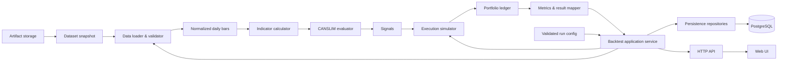

# Kế hoạch kỹ thuật backtest HPG

Cập nhật: 11/09/2026.

Tài liệu này ghi các quyết định triển khai và thứ tự xây hệ thống. Requirement chi
tiết nằm trong [SRS](software-requirements-specification.md), còn cấu trúc module và
luồng runtime nằm trong [System Design](system-design.md).

## 1. Mục tiêu hiện tại

- Phase 1 tự xây một backtest core cho dữ liệu HPG daily,
  `canslim_breakout_v0`, long-only và tối đa một vị thế.
- Không dùng `backtesting.py` làm dependency hoặc source of truth của production
  core. Nó có thể sẽ được áp dụng trong một hệ thống khác để so sánh cách vận hành với kết quả hiện tại.
- API chỉ gọi application
  service; không chứa indicator, strategy hay accounting logic.
- Có Web UI để chạy và xem backtest. Bước UI đầu tiên hiển thị
  P/L, equity, fills và lịch sử giao dịch; chart nến được triển khai ở Phase 3.
- PostgreSQL là system of record cho dataset metadata và lịch sử backtest.
- Core vẫn chạy deterministic và không import database code. Application service
  lưu `BacktestResult` qua repository interface sau khi core hoàn tất.

## 2. Bộ tài liệu kỹ thuật

| Tài liệu                                       | Câu hỏi được trả lời                                            |
| ------------------------------------------------ | ---------------------------------------------------------------------- |
| [SRS](software-requirements-specification.md)     | Hệ thống phải làm gì và điều kiện nghiệm thu là gì?        |
| [CANSLIM Rule](canslim-rules.md)                  | Khi nào sinh BUY/SELL và sizing được tính thế nào?             |
| [System Design](system-design.md)                 | Các module, dependency, state transition và runtime flow là gì?    |
| [Data Contract](data-contract.md)                 | Input/output có field gì, được validate và version ra sao?       |
| [Database Schema](database-schema.md)             | PostgreSQL lưu run/decision/trade history và dataset thế nào?      |
| [Web UI Specification](web-ui-specification.md)   | UI tối thiểu và ranh giới chart Phase 3 là gì?                   |
| [Accounting Test Cases](accounting-test-cases.md) | Cash, fee, P/L và equity kỳ vọng bằng số cụ thể là bao nhiêu? |
| [Backtest Plan v0](backtest-plan-v0.md)           | Phase, lịch và output quản lý công việc là gì?                 |

## 3. Kiến trúc tổng thể



Luồng xử lý chi tiết, state machine và interface nằm tại
[system-design.md](system-design.md).

## 4. Thành phần cần triển khai

| Thành phần           | Trách nhiệm                                                         | Không được làm                                 |
| ---------------------- | --------------------------------------------------------------------- | --------------------------------------------------- |
| Data loader/validator  | Đọc snapshot, chuẩn hóa field, kiểm tra schema và chronology    | Tự điền dữ liệu thiếu hoặc tìm nguồn khác |
| Indicator calculator   | SMA200, pivot/depth 65 phiên, average volume 50 phiên               | Dùng bar tương lai hoặc partial warm-up         |
| Strategy evaluator     | Áp dụng đúng`canslim_breakout_v0`, tạo signal và reason       | Tạo fill hoặc sửa portfolio                      |
| Execution simulator    | Xử lý pending signal tại Open kế tiếp, slippage, fee và sizing  | Khớp tại Close đã tạo signal                   |
| Portfolio ledger       | Cash, position, fees, realized/unrealized P/L, equity                 | Sửa lịch sử sau khi đã ghi                     |
| Result mapper          | Signals, orders/fills, trades, equity history và summary             | Suy diễn giao dịch từ signal                     |
| Application service    | Điều phối một run và trả lỗi có cấu trúc                    | Chứa rule nghiệp vụ                              |
| Persistence repository | Lưu/reload datasets, runs, signals, orders, fills, trades và equity | Đưa SQL vào domain core                          |
| Artifact storage       | Lưu raw snapshot/export lớn theo content hash                       | Làm system of record cho query history             |
| API adapter            | Validate request, gọi application service, serialize response        | Gọi trực tiếp từng module domain                |
| Web UI                 | Hiển thị summary, equity, fills và trade history từ API           | Tự tính signal, fill hoặc P/L khác backend      |

## 5. Daily event order

Với mỗi phiên giao dịch `t`, engine xử lý theo thứ tự:

1. Nhận bar `t` đã được data layer xác nhận hợp lệ.
2. Tại Open, xử lý pending order từ signal của phiên trước; tính fill, fixed
   fractional sizing 2%, fee và cập nhật portfolio.
3. Sau Close, cập nhật indicator chỉ bằng dữ liệu đến hết `t`.
4. Nếu đang giữ vị thế, đánh giá exit trước; nếu flat, đánh giá entry.
5. Signal hợp lệ tạo pending order cho phiên kế tiếp, không tạo fill tại `t`.
6. Ghi cash, position, market value, unrealized P/L và equity tại Close `t`.

Hệ quả:

- Entry tại Open `t` có thể tạo exit signal tại Close `t`, nhưng chỉ được bán từ
  Open phiên sau.
- Exit tại Open `t` cho phép đánh giá entry mới tại Close `t`.
- Signal cuối dataset được ghi nhận nhưng không có fill.
- Thiếu expected next bar phải tạo trạng thái/lỗi kiểm tra được, không tự nhảy qua
  khoảng trống dữ liệu.

## 7. Thứ tự triển khai Phase 1

1. Hoàn tất Data Contract và fixtures daily HPG/VN-Index.
2. Viết validator và test lỗi schema/chronology/OHLC.
3. Viết portfolio/execution spike bằng fixed signals; đối chiếu ACC-01–03.
4. Viết indicator bằng rolling window không look-ahead và boundary tests.
5. Viết strategy evaluator và signal reasons.
6. Nối event loop, pending order, risk sizing 2% và equity history.
7. Thêm causality test: full dataset và dataset cắt tại `t` phải giống nhau đến `t`.
8. Tạo PostgreSQL migrations và repository contract tests.
9. Thêm application service: lưu run cùng toàn bộ history bằng transaction sau khi
   core hoàn tất.
10. Thêm API tối thiểu để tạo, liệt kê và mở lại run đã lưu.
11. Xây Web UI kết quả dạng bảng/cards/equity; để candlestick chart và marker trực
    quan sang Phase 3.

## 8. Cấu trúc source dự kiến

Đây là target structure, chưa phải yêu cầu tạo file rỗng trước khi code:

```text
src/
  backtest_hpg/
    data/
    indicators/
    strategy/
    execution/
    portfolio/
    metrics/
    application/
    persistence/
    api/
tests/
  unit/
  integration/
  fixtures/
web/
  src/
migrations/
```

Domain modules không import từ `api`. Test fixture nhỏ nằm trong `tests/fixtures`;
dataset thị trường lớn và output local tiếp tục được Git ignore theo project rule.

## 9. Quyết định đã chốt và còn mở

Đã chốt cho MVP:

- VNDIRECT dchart daily là working dataset; tải 2019–2023 để có warm-up năm 2019,
  kỳ báo cáo là 2020–2023.
- Config báo cáo dùng vốn 10.000.000 VND, `fee_rate = 0.001` và
  `slippage_rate = 0.002`.
- PostgreSQL lưu run history; API và Web UI mở lại kết quả theo `run_id`.
- UI cards/tables/equity tối thiểu có trước; candlestick và fill markers để Phase 3.

Còn mở:

- Đơn vị giá chính thức, volume adjustment và corporate-action handling của
  VNDIRECT; output hiện tại phải ghi normalized simulation.
- Framework API và dependency versions sau khi core đã ổn định.
- Web framework; chart library chỉ cần chốt trước Phase 3.
- Artifact storage production và retention policy; Phase đầu có thể dùng local
  filesystem adapter cho raw snapshot/export.
- Khi nào volume đủ lớn để partition table; không partition chỉ vì dự đoán trước.

Không tự chọn một phương án cho các mục này trong implementation nếu task chưa chỉ
định hoặc tài liệu liên quan chưa chốt.
